# TVController.cpp refactoring plan
_Exported on 5/19/2026 at 15:32:00 GMT+9 from Cursor (3.4.17)_

---

**User**

@remoteKey.h @Tuner.h @TVController.h @TVController.cpp
@01_requirements_analysis.md @02_code_quality_report.md 

[P] 모던 C++ 리팩토링 코치입니다.
[C] 제약: remotekey emum 수정 금지, Channle 0~99, 테스트 Green에서만 진행
[T] TVController.cpp 파일 안에 전체 함수 리팩토링 계획을 단계별로 제안해줘.
    - 조건 분기 축소/중복 제거 (커밋 단위로 쪼개기)
    - 타입/정책 분리 (전략 패턴/테이블 기반/함수 분해)
    - 매직 넘버 상수화와 C++17 스타일 개선
[F] 단계별 체크리스트 + 각 단계 검증 방법 (cmake --build && ctest)

---

**Cursor**

관련 소스와 요구·품질 문서를 읽고, TVController.cpp 기준으로 커밋 단위 리팩토링 계획을 정리합니다.


현재 `TVController.cpp`는 이미 헤더에 역할별 private 메서드가 나뉘어 있고, `MIN_CHANNEL`/`MAX_CHANNEL` 상수도 있습니다. 아래는 **동작 변경 없이** `remoteKey` enum은 건드리지 않고, **0~99 채널**, **매 단계 Green**을 전제로 한 **커밋 단위 리팩토링 로드맵**입니다.

---

## 전제: 매 단계 공통 검증

```powershell
cd c:\DEV\TDD_TV_08\build
cmake --build . --config Debug
ctest -C Debug --output-on-failure
```

- `build` 디렉터리가 없으면: `cmake -S .. -B .` 후 위 명령 실행.
- **규칙:** 한 커밋 = 한 논리 변경. 실패 시 해당 커밋만 revert 후 다음 단계로 가지 않음.

---

## Phase 0 — Green 기준선 고정 (커밋 0, 선택)

| 체크 | 내용 |
|:---:|------|
| ☐ | `ctest` 전 시나리오 Green 확인 |
| ☐ | (선택) `build-golden`과 동일 결과인지 비교 |

**검증:** 위 `cmake --build && ctest` 1회. 이후 모든 단계에서 동일 명령 반복.

---

## Phase 1 — 무의미 간접·Dead code 제거 (Low risk)

**목표:** 호출 스택만 늘리는 코드 제거 (`02_code_quality_report` §5, §7-5).

| # | 작업 | 대상 | 기대 효과 |
|---|------|------|-----------|
| 1.1 | `setTunerCh()` 제거 → `KEY_OK`에서 `confirmPendingDigits()` 직접 호출 | `pushButton`, `.h` 선언 | 분기 1단 축소 |
| 1.2 | cpp에 `isDigitOrConfirm` 등 **미사용** 함수가 있으면 삭제 | `TVController.cpp` | Dead code 제거 |

**커밋 메시지 예:** `refactor(tv): remove setTunerCh indirection`

**검증 체크리스트**
- ☐ 빌드 경고 없음
- ☐ `DigitThenConfirm_*`, `LeadingZeroThenConfirm_*` 등 OK/숫자 관련 테스트 Green

---

## Phase 2 — 매직 넘버 상수화 + enum 안전성 (Low risk)

**목표:** 요구사항 “2자리 즉시 확정”, “0~99 전체 seek” 의도를 이름으로 고정 (`01` §1.2-1, `02` §4).

| # | 상수 (`.h` private `static constexpr`) | 치환 위치 |
|---|----------------------------------------|-----------|
| 2.1 | `kAutoConfirmDigitCount = 2` | `handleDigit`: `processingCH.size() >= 2` |
| 2.2 | `kChannelCount = MAX_CHANNEL - MIN_CHANNEL + 1` (100) | `handleChannelSearch` 루프 상한 |
| 2.3 | (선택) `kInvalidChannelMsg[]` | `validateChannel` 예외 메시지 |

**추가 (C++17, 동작 불변):**

```cpp
static_assert(remoteKey::KEY_0 < remoteKey::KEY_9);
// digitChar가 enum 연속성에 의존함을 문서화
```

`remoteKey` enum 자체는 **수정 금지** — `static_assert`만 추가.

**커밋:** `refactor(tv): name digit-buffer and seek-loop limits`

**검증**
- ☐ `TwoDigits_*`, `ThirdDigit_*`, `FourDigits_*` Green
- ☐ `ChannelSearch_*` Green

---

## Phase 3 — 정렬 목록 순환 탐색 공통화 (Priority 1, Medium)

**문제:** 아래 세 곳이 **동일 패턴** (empty → early return, `upper_bound`/`lower_bound`, wrap).

```72:86:c:\DEV\TDD_TV_08\src\TVController.cpp
void TVController::handleChannelUp() {
    const int current = getCurrentChannel();
    if (searchedChannels.empty()) {
        const int next = (current == MAX_CHANNEL) ? MIN_CHANNEL : current + 1;
        // ...
    }
    const auto it = std::upper_bound(searchedChannels.begin(), searchedChannels.end(), current);
    // wrap to front
}
```

- `handleChannelUp` — `upper_bound` + 끝이면 `front`
- `handleChannelDown` — `lower_bound` + begin이면 `back` / `prev`
- `handleNextFavorite` — Up과 동일(빈 목록이면 no-op)

**3-A 커밋 (헤더에만 시그니처 + cpp 구현, 기존 핸들러는 아직 그대로)**

```cpp
enum class SortedNavDirection { Next, Previous };

// sorted 비어 있으면 std::nullopt; 아니면 다음 채널 번호
std::optional<int> navigateSortedList(
    const std::vector<int>& sorted,
    int current,
    SortedNavDirection dir) const;
```

| 체크 | 내용 |
|:---:|------|
| ☐ | `Next`: `upper_bound` + wrap `front` |
| ☐ | `Previous`: `lower_bound` + wrap `back` |
| ☐ | `sorted.empty()` → `nullopt` |

**3-B 커밋:** `handleNextFavorite`만 공통 함수로 교체 (가장 단순).

**3-C 커밋:** `handleChannelUp`/`Down`의 **검색 목록 분기**만 교체.  
일반 0~99 순환(`empty` 분기)은 **아직 인라인 유지**.

**커밋 순:** `extract navigateSortedList` → `use in next favorite` → `use in ch up/down`

**검증 (요구사항 11~12, 18~21)**

- ☐ `NextFavorite_*`
- ☐ `ChannelUpWithSearchResult_*`, `ChannelDownWithSearchResult_*`
- ☐ `ChannelUpWithoutSearch_*`, `ChannelDownWithoutSearch_*` (empty 분기는 기존 로직)

---

## Phase 4 — 선형 범위(0~99) 네비게이션 분리 (Policy 분리 1)

**목표:** “전체 채널 링” vs “부분 집합 링” 정책 분리 (`02` §3.2, §6.2).

| # | 작업 |
|---|------|
| 4.1 | anonymous namespace에 **무상태** 함수 추가 (전략 패턴까지 가지 않아도 됨): |

```cpp
int navigateLinearRange(int current, SortedNavDirection dir) {
    if (dir == SortedNavDirection::Next)
        return (current == MAX_CHANNEL) ? MIN_CHANNEL : current + 1;
    return (current == MIN_CHANNEL) ? MAX_CHANNEL : current - 1;
}
```

| 4.2 | `handleChannelUp`/`Down`의 `searchedChannels.empty()` 분기를 위 함수로 교체 |

**이후 형태 (의사코드):**

```cpp
void TVController::handleChannelUp() {
    const int current = getCurrentChannel();
    const int next = searchedChannels.empty()
        ? navigateLinearRange(current, SortedNavDirection::Next)
        : navigateSortedList(searchedChannels, current, SortedNavDirection::Next).value();
    setChannel(next);
}
```

**커밋:** `refactor(tv): extract linear 0-99 channel navigation`

**검증:** `ChannelUpWithoutSearch_WrapsFromMaxToMin`, `ChannelDownWithoutSearch_WrapsFromMinToMax`

---

## Phase 5 — Up/Down 정책 선택기 (함수 분해, Optional 전략)

**목표:** `handleChannelUp`/`Down` **본문 중복 제거** (dir만 다름).

| # | 작업 |
|---|------|
| 5.1 | `int resolveNextChannel(int current, SortedNavDirection dir) const` 추가 |
| 5.2 | 내부: `searchedChannels.empty()` ? linear : sorted |
| 5.3 | `handleChannelUp` → `setChannel(resolveNextChannel(..., Next))` 한 줄 |
| 5.4 | `handleChannelDown` → `Previous` |

**커밋:** `refactor(tv): unify channel up/down resolution`

**검증:** Phase 3·4와 동일 CH Up/Down 테스트 전부.

---

## Phase 6 — `handleChannelSearch` 분해 + 방어 파싱 (Priority 4)

**현재 Long Method:**

```129:154:c:\DEV\TDD_TV_08\src\TVController.cpp
void TVController::handleChannelSearch() {
    searchedChannels.clear();
    // loop: seekCH, wrapped flag, find+push_back, sort
}
```

| 커밋 | 추출 함수 | 책임 |
|------|-----------|------|
| 6.1 | `collectSeekResults()` → `std::vector<int>` | seek 루프, `wrapped`, 중복 제거 |
| 6.2 | `deduplicateAndSort(std::vector<int>&)` 또는 수집 시 `std::set` | 정렬·중복 |
| 6.3 | `handleChannelSearch`는 `searchedChannels = collect...` 한 줄 | SRP |

**6.1에서 동작 유지 주의**

- 루프 상한: Phase 2의 `kChannelCount`
- `chStr.empty()` → break (현행 유지)
- `std::stoi` 후 **`validateChannel` 또는 `parseChannel` 재사용** — Tuner 이상값 방어 (`02` §36)

**커밋:** `refactor(tv): split channel search scan from sort`

**검증:** `ChannelSearchThenUp_*`, `ChannelSearch_StoresSeekResults` (있는 경우)

---

## Phase 7 — 숫자 입력 정책 캡슐화 (Priority 2, `.cpp` 내부 우선)

**목표:** `pushButton`의 “숫자/확인 vs 기능키 + 버퍼 무효화”를 한곳으로 (`01` §1.2-1, `02` §43).

**7-A — private 메서드로 응집 (클래스 분리 전)**

| 메서드 | 역할 |
|--------|------|
| `bool isNonDigitNonConfirm(remoteKey) const` | digit/OK 아님 |
| `void invalidatePendingIfNeeded(remoteKey key)` | 기능키 전 버퍼 클리어 |
| `void handleDigitInput(remoteKey key)` | digit / OK 분기 |

`pushButton` 목표 형태:

```cpp
void TVController::pushButton(remoteKey key) {
    if (isDigitKey(key) || key == remoteKey::KEY_OK) {
        if (isDigitKey(key)) handleDigit(key);
        else confirmPendingDigits();
        return;
    }
    invalidatePendingIfNeeded(key);
    dispatchFunctionKey(key);  // Phase 8
}
```

**7-B (선택, 별 커밋):** `struct DigitInputState { std::string buffer; ... }`를 `TVController` 멤버로 — `processingCH` 직접 접근 축소.

**커밋:** `refactor(tv): centralize digit buffer invalidation policy`

**검증**

- ☐ `PendingSingleDigitNonConfirmFunction_*`
- ☐ `FourDigits_*`, `ThirdDigit_*`, `LeadingZeroThenDigit_*`

---

## Phase 8 — 기능키 테이블 디스패치 (Priority 3, OCP)

**제약:** `remoteKey` enum 수정 없음 → **기존 case만** 테이블에 등록.

```cpp
using MemberFn = void (TVController::*)();
static const std::array<std::pair<remoteKey, MemberFn>, 5> kFunctionKeys = {{
    {remoteKey::KEY_CH_UP, &TVController::handleChannelUp},
    // ...
}};

void TVController::dispatchFunctionKey(remoteKey key) {
    for (const auto& [k, fn] : kFunctionKeys) {
        if (key == k) { (this->*fn)(); return; }
    }
}
```

- C++17: structured binding + `std::array` (해시맵보다 키 5개에 적합).
- `default: break` 동작 유지.

**커밋:** `refactor(tv): table-dispatch function keys in pushButton`

**검증:** 기능키 관련 테스트 전체 1회.

---

## Phase 9 — 채널 파싱 단일 진입점 (타입 분리 Lite)

**목표:** `stoi` 산재 제거 (`02` §47). **별도 public API 추가 없이** private만.

| # | 작업 |
|---|------|
| 9.1 | `[[nodiscard]] std::optional<int> tryParseChannel(std::string_view s) const` — 성공 시 0~99, 실패 시 nullopt |
| 9.2 | `getCurrentChannel`, `handleChannelSearch` 루프가 이를 사용 |
| 9.3 | `parseChannel`은 `tryParseChannel` + throw 유지 (기존 예외 테스트 호환) |

강타입 `ChannelNumber` 클래스는 **테스트/헤더 영향**이 있으면 **마지막 선택** 단계로.

**커밋:** `refactor(tv): consolidate channel string parsing`

**검증:** `SetChannelWithNegativeValue_*`, `SetChannelOutOfRange_*` (있으면)

---

## Phase 10 — C++17·미세 최적화 (Priority 5, 각각 독립 커밋)

| 커밋 | 변경 | 위험 |
|------|------|------|
| 10.1 | `toggleFavorite`: `lower_bound` 위치에 `insert`/`erase` → 매번 `sort` 제거 | 낮음 |
| 10.2 | 검색 중복: `std::set<int>` 임시 → `vector` | 낮음 |
| 10.3 | `Tuner&` 참조 (생성자·테스트 시그니처 변경) | **중** — 테스트/mock 수정 필요 시 별 PR |
| 10.4 | `std::optional<std::string>`로 `processingCH` | 중 |

**각 커밋 후 `ctest` 필수.**

---

## 권장 커밋 순서 요약

```mermaid
flowchart LR
    P0[0 Green baseline] --> P1[1 Dead/indirection]
    P1 --> P2[2 Constants]
    P2 --> P3[3 navigateSortedList]
    P3 --> P4[4 Linear range]
    P4 --> P5[5 resolveNextChannel]
    P5 --> P6[6 Search split]
    P6 --> P7[7 Digit policy]
    P7 --> P8[8 Key table]
    P8 --> P9[9 Parse unify]
    P9 --> P10[10 Micro opts]
```



| 순서 | Phase | 핵심 산출물 | 회귀 위험 |
|:---:|-------|-------------|-----------|
| 1 | 1 | 얇은 `pushButton` | 최저 |
| 2 | 2 | `kAutoConfirmDigitCount` 등 | 최저 |
| 3 | 3~5 | `navigateSortedList` + linear + `resolveNextChannel` | 중 (Up/Down/즐겨찾기) |
| 4 | 6 | 검색 스캔 분리 | 중 |
| 5 | 7~8 | 입력 정책 + 테이블 디스패치 | 중 |
| 6 | 9~10 | 파싱·성능·수명 | 낮~중 |

---

## 단계별 “완료” 정의 (코치 체크)

각 커밋 전:

1. **Before:** `ctest` Green  
2. **Change:** 위 표의 **한 행**만 구현  
3. **After:** `cmake --build . && ctest -C Debug --output-on-failure`  
4. **Review:** diff가 “구조 변경만”인지 — 요구사항 표(`01` §1.2)와 대조  
5. **Commit** → 다음 Phase

---

## 의도적으로 하지 않을 것 (제약 준수)

| 항목 | 이유 |
|------|------|
| `remoteKey` enum / `to_string` switch 변경 | 사용자 제약 |
| 채널 범위 0~99 밖 로직 변경 | 요구사항 고정 |
| Red 상태에서 리팩토링 | TDD 제약 |
| 한 커밋에 Phase 3+7 동시 적용 | 회귀 원인 추적 불가 |

---

원하시면 **Phase 1~3만** 실제 코드로 적용하는 첫 커밋 diff까지 이어서 진행할 수 있습니다. 시작 전 `build`에서 `ctest` Green인지 한 번만 확인해 주시면 됩니다.

---

**User**

Report 폴더에 보고서 작성해줘

---

**Cursor**

Report 폴더의 기존 보고서 형식을 확인한 뒤, 리팩토링 계획 보고서를 작성합니다.


기존 Report 문서 형식(RPT 번호, 표·체크리스트)에 맞춰 리팩토링 계획 보고서를 작성합니다.


`Report` 폴더에 리팩토링 계획 보고서를 추가했습니다.

**파일:** [Report/07_TVController_모던C++_리팩토링_계획_보고서.md](c:\DEV\TDD_TV_08\Report\07_TVController_모던C++_리팩토링_계획_보고서.md)  
**문서 번호:** RPT-07

기존 보고서(RPT-01~06)와 같은 형식으로 구성했습니다.

| 섹션 | 내용 |
|------|------|
| §1 | 개요, 제약(C1~C4), 현재 스냅샷, 품질 이슈 |
| §2 | 함수별 역할·호출 흐름(mermaid) |
| §3 | 공통 검증 (`cmake --build` + `ctest`) |
| §4 | Phase 0~10 단계별 작업·코드 예시·검증 테스트 |
| §5~6 | 커밋 순서·실행용 체크리스트 |
| §7 | 요구사항 추적 매트릭스 |
| §8~9 | 비범위, 기대 효과 |
| §10~11 | 참고 문서, 결론 |

이전 대화의 리팩토링 코치 계획을 프로젝트 문서 체계에 맞춰 정리한 것이며, Phase별 실제 코드 적용 후에는 문서 말미에 안내한 대로 `Report/08_*` 구현 보고서로 후속 정리할 수 있습니다.

