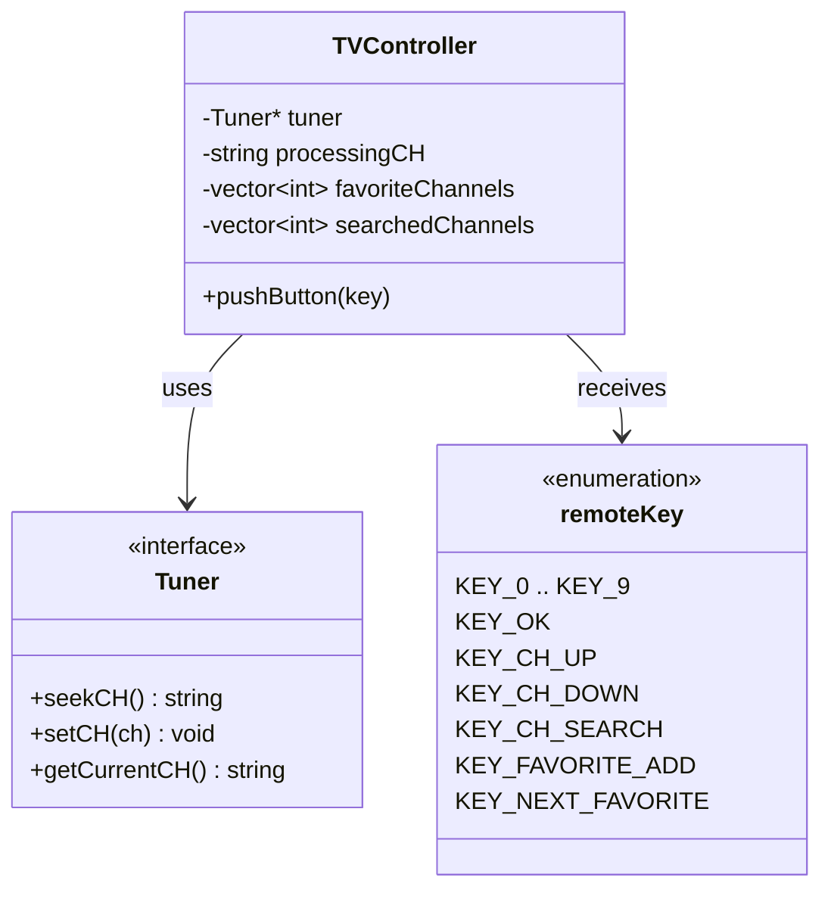

# TDD TV 프로젝트 — TVController 구현 보고서

| 항목 | 내용 |
|---|---|
| 문서 번호 | RPT-02 |
| 단계 | 3단계 — Controller 구현 (Implementation) |
| 프로젝트 | TDD TV (C++17, CMake, Google Test) |
| 기준 문서 | `README.md`, `Report/01_요구사항_분석_보고서.md` |
| 작성 관점 | 시니어 C++ 아키텍트 / 모던 C++ 개발자 |
| 작성일 | 2026-05-19 |

---

## 1. 보고서 개요

본 보고서는 요구사항 분석(RPT-01)을 바탕으로 **TVController 모듈**을 C++17로 구현한 결과를 정리한다. 리모컨 키 입력을 받아 채널 상태를 관리하고, 외부 `Tuner` 인터페이스에 실제 채널 변경을 위임하는 Controller의 설계·구현·빌드 현황을 기술한다.

### 1.1 작업 범위

| 구분 | 내용 |
|---|---|
| 신규 생성 | `src/TVController.cpp` |
| 수정 | `include/TVController.h`, `include/remoteKey.h`, `CMakeLists.txt` |
| 선행 문서 | `Report/01_요구사항_분석_보고서.md`, `docs/01_requirements_analysis.md` |

### 1.2 구현 목표

- `README.md` 및 RPT-01에 정의된 6개 TDD practice 기능을 `pushButton()` 단일 진입점으로 처리
- `Tuner` 구체 구현에 대한 의존 제거 (인터페이스 + 포인터 주입)
- 헤더/소스 분리로 유지보수성 확보

---

## 2. 프로젝트 구조 변경

### 2.1 디렉터리 구조 (Controller 관련)

```
TDD_TV_08/
├── include/
│   ├── Tuner.h              # Tuner 인터페이스 (기존)
│   ├── remoteKey.h          # 리모컨 키 enum (확장)
│   └── TVController.h       # Controller 선언 (리팩터링)
├── src/
│   └── TVController.cpp     # Controller 구현 (신규)
├── test/
│   └── TVControllerTest.cpp # 단위 테스트 (스켈레톤)
└── CMakeLists.txt           # TVController.cpp 링크 추가
```

### 2.2 빌드 설정 변경

`CMakeLists.txt`에서 `TVControllerTest` 실행 파일에 구현 소스를 연결하였다.

```cmake
add_executable(TVControllerTest test/TVControllerTest.cpp src/TVController.cpp)
target_link_libraries(TVControllerTest GTest::gtest_main GTest::gmock)
```

---

## 3. 아키텍처 설계

### 3.1 클래스 다이어그램 (개념)



### 3.2 설계 원칙

| 원칙 | 적용 내용 |
|---|---|
| 의존성 역전 (DIP) | `Tuner*` 추상 인터페이스에만 의존, 구현체는 테스트 시 Mock/Fake로 교체 |
| 단일 책임 (SRP) | 숫자 입력·선호 채널·검색·업다운 로직을 private 메서드로 분리 |
| 타입 안전성 | `remoteKey` enum class로 키 입력 모델링 |
| 방어적 프로그래밍 | 채널 범위 `0~99` 검증 후 `Tuner::setCH()` 호출 |

### 3.3 상태 관리

| 멤버 변수 | 타입 | 역할 |
|---|---|---|
| `tuner` | `Tuner*` | 채널 설정·조회·검색 위임 대상 |
| `processingCH` | `std::string` | 숫자 버튼 입력 버퍼 (최대 2자리 확정 규칙) |
| `favoriteChannels` | `std::vector<int>` | 선호 채널 목록 (정렬, 중복 없음) |
| `searchedChannels` | `std::vector<int>` | 채널 검색 결과 (정렬, 중복 없음) |

채널 범위 상수:

```cpp
static constexpr int MIN_CHANNEL = 0;
static constexpr int MAX_CHANNEL = 99;
```

---

## 4. 리모컨 키 정의 (`remoteKey.h`)

기존 `KEY_1`, `KEY_OK`만 존재하던 enum을 README 요구에 맞게 확장하였다.

| 키 | enum 값 | 용도 |
|---|---|---|
| 0 ~ 9 | `KEY_0` ~ `KEY_9` | 채널 번호 직접 입력 |
| 확인 | `KEY_OK` | 1자리 숫자 확정 |
| 채널 업 | `KEY_CH_UP` | 다음 채널 |
| 채널 다운 | `KEY_CH_DOWN` | 이전 채널 |
| 채널 검색 | `KEY_CH_SEARCH` | 시청 가능 채널 검색 |
| 선호채널 추가 | `KEY_FAVORITE_ADD` | 선호 채널 toggle |
| 다음 선호채널 | `KEY_NEXT_FAVORITE` | 선호 목록 내 다음 채널 |

---

## 5. 기능별 구현 상세

### 5.1 숫자 버튼 채널 변경

**진입:** `pushButton()` → `isDigitKey()` → `handleDigit()`

| 규칙 | 구현 |
|---|---|
| 1자리 + 확인 | `KEY_OK` 시 `confirmPendingDigits()` → `setChannel()` |
| 2자리 완성 시 즉시 확정 | `processingCH.size() >= 2`이면 `confirmPendingDigits()` 호출 |
| 3번째 숫자는 새 버퍼 시작 | 2자리 확정 후 버퍼 초기화 → 다음 숫자가 1자리로 누적 |
| 선행 0 처리 | `std::stoi(processingCH)`로 `"07"` → 7 변환 |
| 기능 버튼 시 버퍼 무효화 | 숫자/확인 외 키 입력 전 `clearPendingDigits()` |

**핵심 코드 흐름:**

```
숫자 키 → processingCH에 누적
         → 2자리면 즉시 confirmPendingDigits()
확인 키 → confirmPendingDigits()
기능 키 → clearPendingDigits() 후 해당 기능 수행
```

### 5.2 선호 채널

| 기능 | 메서드 | 동작 |
|---|---|---|
| 선호채널추가 | `toggleFavorite()` | 현재 채널이 목록에 없으면 추가, 있으면 삭제 |
| 다음선호채널 | `handleNextFavorite()` | `upper_bound`로 현재보다 큰 최소값, 없으면 최소값으로 순환 |

### 5.3 채널 검색

| 기능 | 메서드 | 동작 |
|---|---|---|
| 채널검색 | `handleChannelSearch()` | `Tuner::seekCH()` 반복 호출, 시작 채널로 순환 완료 시 종료, 결과를 `searchedChannels`에 중복 없이 저장 후 정렬 |

### 5.4 채널 업/다운

| 조건 | 메서드 | 알고리즘 |
|---|---|---|
| 검색 결과 없음 | `handleChannelUp/Down()` | 현재 ±1, 0↔99 순환 |
| 검색 결과 있음 | `handleChannelUp/Down()` | `upper_bound` / `lower_bound` + `prev`로 저장 목록 내 이동 및 순환 |

### 5.5 채널 검증 및 예외

| 조건 | 처리 |
|---|---|
| `ch < 0` 또는 `ch > 99` | `std::invalid_argument("Invalid channel")` 발생 |
| Tuner 호출 | `validateChannel()` 통과 후에만 `tuner->setCH()` 호출 |

---

## 6. 요구사항 ↔ 구현 매핑

| RPT-01 항목 | README 기능 | 구현 메서드 | 상태 |
|---:|---|---|---|
| 1 | 숫자 버튼 채널 변경 | `handleDigit`, `confirmPendingDigits`, `setTunerCh` | 구현 완료 |
| 2 | 선호 채널 추가/삭제 | `toggleFavorite` | 구현 완료 |
| 3 | 다음 선호 채널 | `handleNextFavorite` | 구현 완료 |
| 4 | 채널 검색 | `handleChannelSearch` | 구현 완료 |
| 5 | 업/다운 (검색 없음) | `handleChannelUp`, `handleChannelDown` | 구현 완료 |
| 6 | 업/다운 (검색 있음) | `handleChannelUp`, `handleChannelDown` | 구현 완료 |

---

## 7. public API

```cpp
class TVController {
public:
    explicit TVController(Tuner* tuner);
    void pushButton(remoteKey key);
};
```

- **생성자:** `Tuner*`를 주입받아 소유하지 않음 (수명은 호출자 관리)
- **pushButton:** 모든 리모컨 입력의 단일 진입점

---

## 8. 빌드 및 테스트 현황

### 8.1 빌드

| 항목 | 결과 |
|---|---|
| 컴파일러 | GCC 15.2.0 (MinGW) |
| C++ 표준 | C++17 |
| 빌드 타겟 | `TVControllerTest` |
| 빌드 결과 | 성공 |

### 8.2 테스트

| 테스트 스위트 | 테스트 수 | 결과 |
|---|---:|---|
| `TVControllerTest` | 1 (`testFramework`) | PASSED |

> **참고:** RPT-01에 정의된 25개 시나리오는 아직 `test/TVControllerTest.cpp`에 미작성 상태이다. 현재는 Google Test 프레임워크 연동 확인용 스켈레톤만 존재한다.

---

## 9. RPT-01 대비 미완료·후속 작업

| 우선순위 | 항목 | 설명 |
|---:|---|---|
| 1 | TDD 테스트 25건 작성 | `Report/01` §6 시나리오를 Red-Green-Refactor로 추가 |
| 2 | Mock 기반 검증 | `MockTunerForController`에 `EXPECT_CALL`로 `setCH`/`seekCH` 호출 검증 |
| 3 | 선호/검색 목록 조회 API | 테스트 용이성을 위해 getter 추가 검토 (필요 시) |
| 4 | `isDigitOrConfirm` 정리 | `TVController.cpp`에 미사용 헬퍼 존재 — 제거 또는 활용 결정 |

---

## 10. 결론

TVController 모듈은 RPT-01 요구사항을 반영하여 **헤더/소스 분리 구조**로 구현되었으며, 숫자 입력 버퍼·선호 채널·채널 검색·업/다운·채널 범위 검증 로직이 `src/TVController.cpp`에 포함되었다. 빌드는 정상적으로 완료되었으나, **TDD 관점의 본격적인 단위 테스트는 다음 단계**에서 RPT-01 §6의 25개 시나리오를 순차적으로 추가해야 한다.

| 단계 | 문서 | 상태 |
|---|---|---|
| 1단계 | RPT-01 요구사항 분석 | 완료 |
| 2단계 | 테스트 케이스 설계 | 미착수 |
| 3단계 | Controller 구현 | **본 보고서 (완료)** |
| 4단계 | Mock/Fake 연동 회귀 테스트 | 미착수 |

---

*본 문서는 `src/TVController.cpp`, `include/TVController.h`, `include/remoteKey.h` 구현 결과를 기준으로 작성되었다.*
