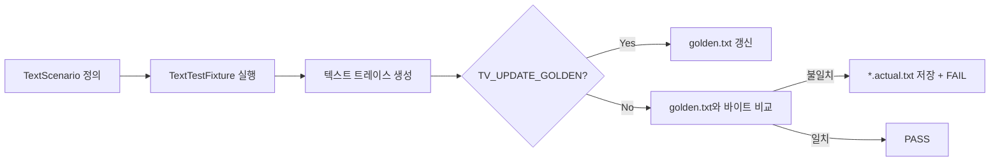

# TDD TV 프로젝트 — TVController Golden Master 회귀 테스트 보고서

| 항목 | 내용 |
|---|---|
| 문서 번호 | RPT-06 |
| 단계 | 7단계 — 회귀 테스트 (Golden Master / Approval) |
| 프로젝트 | TDD TV (C++17, CMake, Google Test) |
| 기준 문서 | `README.md`, `Report/03_테스트_계획_보고서.md`, `Report/04_TVController_테스트_구현_보고서.md`, `docs/01_requirements_analysis.md` |
| 대상 모듈 | `TVController` (`include/TVController.h`, `src/TVController.cpp`) |
| 테스트 산출물 | `test/TextTestFixture.*`, `test/TVControllerGoldenTest.cpp`, `test/golden/*.golden.txt` |
| CI | `.github/workflows/ci.yml` |
| 작성 관점 | Approval / Golden Master 회귀 테스트 설계 |
| 작성일 | 2026-05-19 |

---

## 1. 보고서 개요

본 보고서는 `TVController` 모듈에 **TexttestFixture 출력 기반 Golden Master(Approval) 회귀 테스트**를 설계·구현한 결과를 정리한다. 단위 테스트(`TVControllerTest`, Mock 검증)와 별도로, 리모컨 입력 시퀀스에 대한 **관찰 가능한 채널 변화**를 고정 텍스트 스냅샷과 비교하여 회귀를 탐지한다.

### 1.1 목적

| 목적 | 설명 |
|------|------|
| **회귀 방지** | 리팩터링·버그 수정 후 요구사항 동작이 유지되는지 빠르게 확인 |
| **가독성** | 시나리오별 텍스트 트레이스로 동작을 리뷰·승인(Approval) 가능 |
| **이중 검증** | Mock 기반 `TEST_F`와 Golden Master가 상호 보완 |
| **CI 자동화** | `ctest` + GitHub Actions로 PR마다 자동 실행 |

### 1.2 작업 범위

| 구분 | 내용 |
|------|------|
| 신규 | `test/TextTestFixture.h`, `test/TextTestFixture.cpp` |
| 신규 | `test/TVControllerGoldenTest.cpp`, `test/support/GoldenTestUtil.h` |
| 신규 | `test/golden/*.golden.txt` (19개 시나리오) |
| 신규 | `scripts/update_golden.ps1`, `scripts/update_golden.sh` |
| 신규 | `.github/workflows/ci.yml`, 루트 `.gitignore` |
| 수정 | `CMakeLists.txt` — `TVControllerGoldenTest` 타깃, `gtest_discover_tests` |
| 제외 | Tuner 실구현, gcov/lcov, 예외 경로(E-01~E-02) Golden 시나리오 |

### 1.3 완료 기준 달성 현황

| 항목 | 목표 | 결과 |
|------|------|------|
| Golden 시나리오 수 | 요구사항 §5 핵심 커버 | **19건** |
| Expected 파일 보관 | Git 버전 관리 | `test/golden/` 커밋 대상 |
| Google Test 비교 | 시나리오별 `TEST_P` | **구현 완료** |
| CMake / ctest | `TVControllerGoldenTest` 등록 | **라벨 `golden;regression`** |
| CI | push/PR 시 자동 실행 | **`.github/workflows/ci.yml`** |
| 로컬 실행 | Green | **`ctest` 42/42 통과** (Tuner 13 + TVController 10 + Golden 19) |

---

## 2. Golden Master 설계

### 2.1 Approval 테스트 개념



- **Golden Master**: 승인된 기대 출력(`*.golden.txt`)을 기준(마스터)으로 삼는다.
- **Approval**: 의도적 동작 변경 시 golden을 갱신하고 diff를 리뷰한 뒤 커밋한다.

### 2.2 Expected 출력 파일 전략

| 항목 | 정책 |
|------|------|
| **저장 위치** | `test/golden/<시나리오명>.golden.txt` |
| **파일 단위** | 시나리오 1개 = golden 파일 1개 (실패 시 원인 격리 용이) |
| **인코딩·줄바꿈** | UTF-8, LF (`GoldenTestUtil`에서 CR 제거 후 비교) |
| **버전 관리** | Git에 golden 커밋 (소스와 동일 PR에서 리뷰) |
| **갱신 방법** | 환경 변수 `TV_UPDATE_GOLDEN=1` 또는 `scripts/update_golden.*` |
| **실패 산출물** | `test/golden/<시나리오명>.actual.txt` (`.gitignore` 제외) |

### 2.3 출력 텍스트 형식

각 golden 파일은 다음 구조를 따른다.

```text
scenario <시나리오명>
initial <시작 채널>
seek_returns <ch1> <ch2> ...   # 채널 검색 시나리오만
<키이름> -> <현재채널>
...
```

| 줄 유형 | 예시 | 의미 |
|---------|------|------|
| `scenario` | `scenario TwoDigits_ChangesImmediately` | 시나리오 식별자 |
| `initial` | `initial 0` | `FakeTuner` 시작 채널 |
| `seek_returns` | `seek_returns 4 6 14 6` | `seekCH()` Mock 시퀀스 |
| 키 입력 | `1 -> 12` | `pushButton` 후 `getCurrentCH()` 결과 |

**예시** (`DigitThenConfirm_ChangesToSingleDigitChannel.golden.txt`):

```text
scenario DigitThenConfirm_ChangesToSingleDigitChannel
initial 6
1 -> 6
OK -> 1
```

키 이름은 `remoteKey.h`의 `to_string(remoteKey)` 결과를 사용한다 (`1`, `OK`, `CH_UP`, `FAVORITE_ADD` 등).

---

## 3. TextTestFixture 구현

### 3.1 구성 요소

| 구성 요소 | 파일 | 역할 |
|-----------|------|------|
| `TextScenario` | `test/TextTestFixture.h` | 시나리오명, 초기 채널, 키 시퀀스, `seekCH` 반환 목록 |
| `FakeTunerForText` | `test/TextTestFixture.cpp` | 상태ful Fake Tuner (`setCH`/`getCurrentCH`/`seekCH`) |
| `TextTestFixture` | `test/TextTestFixture.cpp` | 시나리오 실행 및 텍스트 렌더링 |
| `GoldenTestUtil` | `test/support/GoldenTestUtil.h` | 파일 I/O, CRLF 정규화, 업데이트 플래그 |
| `TVControllerGoldenTest` | `test/TVControllerGoldenTest.cpp` | `TEST_P` 기반 golden 비교 |

### 3.2 FakeTuner vs MockTuner

| 구분 | `TVControllerTest` (Mock) | `TextTestFixture` (Fake) |
|------|---------------------------|---------------------------|
| 목적 | 호출 횟수·인자 정밀 검증 | **관찰 가능한 최종 채널** 스냅샷 |
| 상태 | `currentCh` + `ON_CALL` | `FakeTunerForText` 내부 문자열 |
| 검증 | `EXPECT_CALL`, `ASSERT_EQ` | golden 파일 전체 문자열 비교 |
| 적합 | 단위 테스트·계약 검증 | **회귀·시나리오 문서화** |

### 3.3 시나리오 등록

시나리오는 `TextTestFixture::allScenarios()`에 정적 배열로 등록한다. 새 시나리오 추가 시:

1. `TextScenario` 항목 추가
2. `TV_UPDATE_GOLDEN=1`로 golden 생성
3. `test/golden/<이름>.golden.txt` 커밋

---

## 4. Google Test 파일 비교 구현

### 4.1 테스트 구조

```cpp
class TVControllerGoldenTest : public ::testing::TestWithParam<std::string> {};

TEST_P(TVControllerGoldenTest, MatchesApprovedOutput) {
    const TextScenario* scenario = TextTestFixture::findScenario(GetParam());
    const std::string actual = TextTestFixture::runScenario(*scenario);
    assertMatchesGolden(scenarioName, actual);
}

INSTANTIATE_TEST_SUITE_P(TVControllerRegression, TVControllerGoldenTest, ...);
```

- **테스트 스위트**: `TVControllerRegression`
- **케이스 수**: 19 (`INSTANTIATE_TEST_SUITE_P`로 시나리오명 1:1)
- **실패 시**: `FAIL()` 메시지에 expected/actual 경로 출력, `*.actual.txt` 기록

### 4.2 Golden 갱신 모드

| 모드 | 조건 | 동작 |
|------|------|------|
| 비교 (기본) | `TV_UPDATE_GOLDEN` 미설정 | `golden.txt`와 `actual` 문자열 일치 검사 |
| 갱신 | `TV_UPDATE_GOLDEN=1` (또는 `0` 이외) | `golden.txt` 덮어쓰기 후 PASS |

---

## 5. 구현된 Golden 시나리오 목록 (19건)

### 5.1 숫자 입력·버퍼 (8건)

| # | 시나리오명 | 요구사항 매핑 | 최종 채널 (golden) |
|---|-------------|---------------|-------------------|
| 1 | `DigitThenConfirm_ChangesToSingleDigitChannel` | §5-1 | 1 |
| 2 | `TwoDigits_ChangesImmediately` | §5-2 | 12 |
| 3 | `FourDigits_ChangesAsTwoPairs` | §5-3 | 34 |
| 4 | `ThirdDigit_StartsNextPendingInput` | §5-4 | 45 (6 보류) |
| 5 | `PendingSingleDigitConfirm_ChangesToPendingDigit` | §5-5 | 6 |
| 6 | `PendingSingleDigitNonConfirmFunction_InvalidatesPendingDigit` | §5-6 | 46 |
| 7 | `LeadingZeroThenDigit_ChangesToDigitChannel` | §5-7 | 7 |
| 8 | `LeadingZeroThenConfirm_ChangesToChannelZero` | §5-8 | 0 |

### 5.2 Up/Down — 검색 없음 (4건)

| # | 시나리오명 | 초기 CH | 기대 |
|---|-------------|---------|------|
| 9 | `ChannelUpWithoutSearchResult_IncrementsChannel` | 6 | 7 |
| 10 | `ChannelDownWithoutSearchResult_DecrementsChannel` | 6 | 5 |
| 11 | `ChannelUpWithoutSearchResult_WrapsFromMaxToMin` | 99 | 0 |
| 12 | `ChannelDownWithoutSearchResult_WrapsFromMinToMax` | 0 | 99 |

### 5.3 채널 검색 + Up/Down (5건)

| # | 시나리오명 | 초기 CH | seek_returns | 기대 |
|---|-------------|---------|--------------|------|
| 13 | `ChannelSearchThenUp_MovesWithinStoredChannels` | 6 | 4,6,14,6 | 14 |
| 14 | `ChannelUpWithSearchResult_ChangesToNextStoredChannel` | 6 | 4,6,14,6 | 14 |
| 15 | `ChannelDownWithSearchResult_ChangesToPreviousStoredChannel` | 6 | 4,6,14,6 | 4 |
| 16 | `ChannelUpWithSearchResult_WrapsToSmallestStoredChannel` | 15 | 4,6,14,6 | 4 |
| 17 | `ChannelDownWithSearchResult_ChangesToNearestLowerStoredChannel` | 15 | 4,6,14,6 | 14 |

### 5.4 선호 채널 (2건)

| # | 시나리오명 | 기대 |
|---|-------------|------|
| 18 | `NextFavorite_ChangesToNearestGreaterFavorite` | 12 |
| 19 | `NextFavorite_WrapsToSmallestFavorite` | 1 |

---

## 6. CMake / ctest 통합

### 6.1 CMake 타깃

```cmake
add_executable(TVControllerGoldenTest
    test/TVControllerGoldenTest.cpp
    test/TextTestFixture.cpp
    src/TVController.cpp
)
target_compile_definitions(TVControllerGoldenTest PRIVATE
    GOLDEN_SOURCE_DIR="${CMAKE_CURRENT_SOURCE_DIR}/test/golden"
)
gtest_discover_tests(TVControllerGoldenTest
    PROPERTIES LABELS "golden;regression"
)
```

| 항목 | 설명 |
|------|------|
| `GOLDEN_SOURCE_DIR` | 빌드 디렉터리와 무관하게 소스 트리의 `test/golden` 참조 |
| `LABELS` | `ctest -L golden`으로 Golden만 선택 실행 가능 |

### 6.2 실행 명령

```bash
# 전체 테스트
cmake -S . -B build
cmake --build build
ctest --test-dir build --output-on-failure

# Golden Master만
ctest --test-dir build -L golden --output-on-failure

# Golden 재생성 (Windows PowerShell)
$env:TV_UPDATE_GOLDEN = "1"
ctest --test-dir build -R TVControllerGoldenTest --output-on-failure
Remove-Item Env:TV_UPDATE_GOLDEN

# 스크립트 (Windows / Linux)
.\scripts\update_golden.ps1
./scripts/update_golden.sh
```

### 6.3 테스트 현황 (로컬 검증)

| 타깃 | 테스트 수 | 라벨 |
|------|------------|------|
| `TunerTest` | 13 | — |
| `TVControllerTest` | 10 | — |
| `TVControllerGoldenTest` | 19 | `golden`, `regression` |
| **합계** | **42** | **100% Passed** |

---

## 7. CI 자동 실행

### 7.1 워크플로 개요

파일: `.github/workflows/ci.yml`

| 단계 | 내용 |
|------|------|
| 트리거 | `main`, `master` 브랜치 push / pull_request |
| Runner | `ubuntu-latest` |
| Configure | `cmake -S . -B build -DCMAKE_BUILD_TYPE=Debug` |
| Build | `cmake --build build --parallel` |
| Test | `ctest --test-dir build --output-on-failure` |
| Golden 검증 | `test/golden/` 미커밋 변경 시 실패 |

### 7.2 Golden 파일 무결성 검사

CI는 테스트 통과 외에 **golden 파일이 워크스페이스에 커밋되어 있는지** 추가로 확인한다.

- `git diff --exit-code test/golden/`
- `git status --porcelain test/golden/` 비어 있어야 함

의도적 golden 변경은 PR에 `test/golden/*.golden.txt` diff를 포함해야 한다.

### 7.3 `.gitignore` 정책

| 경로 | 처리 |
|------|------|
| `build/`, `build-*/` | 무시 |
| `test/golden/*.actual.txt` | 무시 (실패 시에만 생성) |
| `.github/workflows/*.yml` | **추적** (`!.github/workflows/*.yml`) |

---

## 8. TVControllerTest와의 관계

### 8.1 이중 테스트 피라미드

```text
                    ┌─────────────────────┐
                    │ Golden Master (19)  │  ← 시나리오 E2E 스냅샷
                    └──────────┬──────────┘
                               │
                    ┌──────────▼──────────┐
                    │ TVControllerTest(10)│  ← Mock 단위 검증
                    └──────────┬──────────┘
                               │
                    ┌──────────▼──────────┐
                    │ TunerTest (13)      │  ← Tuner 계약 학습
                    └─────────────────────┘
```

### 8.2 커버리지 비교

| 관점 | TVControllerTest | Golden Master |
|------|------------------|---------------|
| 시나리오 수 | 10 | **19** |
| D-04, D-05, U-01, U-02 | RPT-05 기준 미구현 | **Golden에 포함** |
| US-02~US-04, F-04 | 일부 미구현 | **Golden에 포함** |
| Mock `EXPECT_CALL` | 지원 | 미사용 |
| 리팩터링 내성 | Mock 기대 변경 필요 | 출력 동일 시 통과 |

Golden Master는 RPT-05(테스트 구현 보고서)에서 **미완료로 표시된 P0/P1 시나리오**를 보완한다.

---

## 9. 요구사항 추적 매트릭스

| `docs/01_requirements_analysis.md` §5 | Golden 시나리오 | TVControllerTest |
|---------------------------------------|-----------------|------------------|
| 1~8 (숫자·버퍼) | 8건 | 6건 |
| 9~10 (선호 토글) | — (간접) | 부분 |
| 11~12 (다음 선호) | 2건 | 1건 |
| 13 (채널 검색) | 5건 (검색+Up/Down) | 1건 |
| 14~17 (Up/Down 일반) | 4건 | 2건 |
| 18~21 (Up/Down 검색) | 5건 | 1건 |
| 22~25 (예외) | 미포함 | 미포함 |

---

## 10. 운영 가이드

### 10.1 의도적 동작 변경 시

1. `TVController` 또는 시나리오 정의 수정
2. `TV_UPDATE_GOLDEN=1`로 golden 재생성
3. `git diff test/golden/` 리뷰 (Approval)
4. golden + 소스 코드 함께 커밋
5. CI Green 확인

### 10.2 실패 시 디버깅

1. `ctest -R TVControllerGoldenTest --output-on-failure` 실행
2. `test/golden/<시나리오>.actual.txt`와 `.golden.txt` diff
3. `TextTestFixture.cpp`의 키 시퀀스·`seek_returns` 점검

### 10.3 주의사항

- golden 비교는 **플랫폼 독립**을 위해 텍스트만 사용 (바이너리 스냅샷 아님).
- `to_string(remoteKey)` 변경 시 **전체 golden 갱신** 필요.
- 내부 private 상태(`processingCH`, `favoriteChannels`)는 golden에 직접 노출하지 않고 **채널 결과로만** 검증한다.

---

## 11. 미완료 및 후속 작업

| 우선순위 | 항목 | 설명 |
|----------|------|------|
| P2 | 예외 시나리오 Golden | E-01~E-02 — API 훅 또는 별도 시나리오 설계 필요 |
| P2 | `FavoriteButton_*` 전용 golden | 선호 토글만 검증하는 짧은 시나리오 추가 |
| P3 | 커버리지 CI | RPT-04 §6 — `ENABLE_COVERAGE` + lcov 게이트 |
| P3 | 통합 golden | `suite.golden.txt` 단일 파일 모드 (선택) |

---

## 12. 결론

`TextTestFixture` 기반 **Golden Master 회귀 테스트 19건**을 도입하여, `TVController`의 리모컨 입력 시나리오를 **고정 텍스트 스냅샷**으로 검증할 수 있게 하였다. `CMake`/`ctest` 통합 및 **GitHub Actions CI**로 PR마다 단위 테스트와 함께 자동 실행되며, golden 파일은 Git으로 관리·리뷰한다.

RPT-05의 Mock 단위 테스트(10건)와 병행함으로써, **요구사항 §5 핵심 시나리오의 회귀 방지력**이 크게 향상되었다. 예외 경로 및 커버리지 CI는 후속 스프린트에서 확장하는 것을 권장한다.

---

## 13. 관련 문서

| 문서 | 경로 |
|------|------|
| 요구사항 분석 | `Report/01_01_요구사항_분석_보고서.md` |
| Controller 구현 | `Report/01_02_TVController_구현_보고서.md` |
| 테스트 계획 | `Report/03_테스트_계획_보고서.md` |
| 단위 테스트 구현 | `Report/04_TVController_테스트_구현_보고서.md` |
| 결함 분석 | `Report/05_01_TVController_결함_분석_보고서.md` |
| 결함 목록 | `Report/05_02_TVController_결함_목록_보고서.md` |
| **본 보고서** | `Report/06_TVController_GoldenMaster_회귀테스트_보고서.md` |
| TextTestFixture | `test/TextTestFixture.h`, `test/TextTestFixture.cpp` |
| Golden 테스트 | `test/TVControllerGoldenTest.cpp` |
| Expected 출력 | `test/golden/*.golden.txt` |
| CI 워크플로 | `.github/workflows/ci.yml` |
