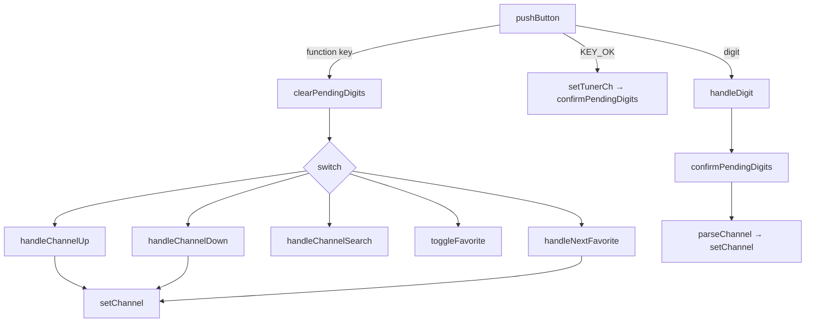

# TDD TV 프로젝트 — TVController 모던 C++ 리팩토링 계획 보고서

| 항목 | 내용 |
|---|---|
| 문서 번호 | RPT-07 |
| 단계 | 8단계 — 리팩토링 계획 (Refactoring Plan) |
| 프로젝트 | TDD TV (C++17, CMake, Google Test) |
| 기준 문서 | `docs/01_requirements_analysis.md`, `docs/02_code_quality_report.md`, `Report/02_코드_품질_분석_보고서.md`, `Report/05_01_TVController_결함_분석_보고서.md` |
| 대상 모듈 | `src/TVController.cpp`, `include/TVController.h` |
| 연관 타입 | `include/remoteKey.h` (enum 수정 금지), `include/Tuner.h` |
| 작성 관점 | 모던 C++ 리팩토링 코치 |
| 작성일 | 2026-05-19 |

---

## 1. 보고서 개요

본 보고서는 **Green 테스트를 유지한 채** `TVController.cpp` 전 함수를 단계적으로 리팩토링하기 위한 실행 계획을 정리한다. 목표는 (1) 조건 분기 축소·중복 제거, (2) 타입·정책 분리(전략/테이블/함수 분해), (3) 매직 넘버 상수화 및 C++17 스타일 개선이다.

### 1.1 제약 조건

| # | 제약 | 근거 |
|---|------|------|
| C1 | `remoteKey` **enum 수정 금지** | 외부 리모컨 계약·테스트 키 모델 고정 |
| C2 | 채널 번호 **0~99** 고정 | `docs/01_requirements_analysis.md` §3 |
| C3 | **테스트 Green에서만** 다음 단계 진행 | TDD 리팩토링 원칙 |
| C4 | **한 커밋 = 한 논리 변경** | 회귀 원인 추적·revert 용이 |

### 1.2 현재 구현 스냅샷

| 항목 | 값 |
|------|-----|
| `TVController.cpp` LOC | 약 191줄 |
| public API | `TVController(Tuner*)`, `pushButton(remoteKey)` |
| 채널 상수 | `MIN_CHANNEL=0`, `MAX_CHANNEL=99` (`TVController.h`) |
| 테스트 | `TVControllerTest` 10건 + `TunerTest` 13건 (Green 전제) |

### 1.3 품질 이슈 요약 (리팩토링 동기)

| 우선순위 | 이슈 | 해당 함수·위치 |
|:---:|------|----------------|
| 1 | 정렬 벡터 + `upper_bound`/`lower_bound` + wrap **중복** | `handleChannelUp`, `handleChannelDown`, `handleNextFavorite` |
| 2 | 일반 0~99 순환 vs 검색/선호 **부분 집합** 탐색 혼재 | `handleChannelUp`/`Down` |
| 3 | `pushButton` **다단 분기** + `switch` | `pushButton` 156~190 |
| 4 | `handleChannelSearch` **Long Method** | `handleChannelSearch` 129~154 |
| 5 | 매직 넘버 `2`, seek 루프 `MAX_CHANNEL` 혼용 | `handleDigit` 67, `handleChannelSearch` 134 |
| 6 | `setTunerCh` **단순 위임** | `setTunerCh` 56~58 |

---

## 2. 현재 함수 구조

### 2.1 함수별 역할

| 함수 | 역할 | LOC |
|------|------|:---:|
| `TVController()` | Tuner 주입, `processingCH` 초기화 | 2 |
| `isDigitKey` | `KEY_0`~`KEY_9` 판별 | 3 |
| `digitChar` | enum → 숫자 문자 | 3 |
| `getCurrentChannel` | `tuner->getCurrentCH()` → `int` | 3 |
| `validateChannel` | 0~99 범위, 예외 | 5 |
| `parseChannel` | 문자열 파싱 + 검증 | 5 |
| `setChannel` | 검증 후 `tuner->setCH` | 4 |
| `confirmPendingDigits` | 보류 숫자 확정 | 7 |
| `setTunerCh` | `confirmPendingDigits` 위임 | 3 |
| `clearPendingDigits` | 버퍼 클리어 | 3 |
| `handleDigit` | 숫자 누적, 2자리 자동 확정 | 6 |
| `handleChannelUp` | 일반/검색 목록 CH+ | 15 |
| `handleChannelDown` | 일반/검색 목록 CH− | 15 |
| `toggleFavorite` | 선호 채널 토글 | 10 |
| `handleNextFavorite` | 선호 목록 순환 | 13 |
| `handleChannelSearch` | `seekCH` 스캔·중복 제거·정렬 | 26 |
| `pushButton` | 입력 라우팅·버퍼 무효화·핸들러 호출 | 35 |

### 2.2 호출 흐름 (요약)



---

## 3. 공통 검증 절차

모든 Phase 적용 **전·후**에 아래 명령을 실행한다.

```powershell
cd c:\DEV\TDD_TV_08\build
cmake --build . --config Debug
ctest -C Debug --output-on-failure
```

| 단계 | 체크 |
|------|------|
| 빌드 | 컴파일·링크 오류 없음 |
| 테스트 | 23/23 Passed (`TunerTest` 13 + `TVControllerTest` 10) |
| 실패 시 | 해당 Phase만 revert, 다음 Phase 진행 금지 |

`build` 디렉터리가 없을 경우:

```powershell
cd c:\DEV\TDD_TV_08
cmake -S . -B build
cmake --build build --config Debug
ctest --test-dir build -C Debug --output-on-failure
```

---

## 4. Phase별 리팩토링 계획

### Phase 0 — Green 기준선 고정 (선택, 커밋 0)

| 체크 | 작업 |
|:---:|------|
| ☐ | `ctest` 전 시나리오 Green 확인 |
| ☐ | (선택) `build-golden`과 결과 비교 |

**검증:** §3 공통 절차 1회.

**커밋:** 없음 (기준선 기록용).

---

### Phase 1 — 무의미 간접·Dead code 제거

**목표:** 호출 스택만 늘리는 코드 제거. 동작 변경 없음.

| # | 작업 | 파일 |
|---|------|------|
| 1.1 | `setTunerCh()` 제거 → `KEY_OK`에서 `confirmPendingDigits()` 직접 호출 | `.h`, `.cpp` |
| 1.2 | cpp 내 **미사용** 함수(`isDigitOrConfirm` 등) 존재 시 삭제 | `.cpp` |

**예상 커밋 메시지:** `refactor(tv): remove setTunerCh indirection`

| 검증 체크 | 관련 테스트 |
|-----------|-------------|
| ☐ 빌드 Green | — |
| ☐ OK/숫자 확정 동작 유지 | `DigitThenConfirm_*`, `LeadingZeroThenConfirm_*` |

---

### Phase 2 — 매직 넘버 상수화 + enum 안전성

**목표:** 요구사항 “2자리 즉시 확정”, “0~99 전체 seek” 의도를 이름으로 고정.

| 상수 (`TVController.h` private) | 치환 위치 |
|--------------------------------|-----------|
| `kAutoConfirmDigitCount = 2` | `handleDigit`: `processingCH.size() >= 2` |
| `kChannelCount = MAX_CHANNEL - MIN_CHANNEL + 1` | `handleChannelSearch` 루프 상한 |
| (선택) `kInvalidChannelMsg[]` | `validateChannel` 예외 메시지 |

**C++17 추가 (동작 불변, enum 미수정):**

```cpp
static_assert(remoteKey::KEY_0 < remoteKey::KEY_9);
// digitChar가 KEY_0~KEY_9 연속성에 의존함을 컴파일 타임 검증
```

**예상 커밋:** `refactor(tv): name digit-buffer and seek-loop limits`

| 검증 체크 | 관련 테스트 |
|-----------|-------------|
| ☐ 2자리 즉시 확정 | `TwoDigits_*`, `ThirdDigit_*`, `FourDigits_*` |
| ☐ 채널 검색 | `ChannelSearchThenUp_*` |

---

### Phase 3 — 정렬 목록 순환 탐색 공통화 (Priority 1)

**문제:** `handleChannelUp`, `handleChannelDown`, `handleNextFavorite`가 동일 패턴(정렬 벡터, bound, wrap)을 반복한다.

| 방향 | 알고리즘 | wrap |
|------|----------|------|
| Next (Up, NextFavorite) | `std::upper_bound` | 끝 → `front()` |
| Previous (Down) | `std::lower_bound` | begin → `back()` / `prev` |

#### 3-A: 공통 함수 도입

```cpp
enum class SortedNavDirection { Next, Previous };

std::optional<int> navigateSortedList(
    const std::vector<int>& sorted,
    int current,
    SortedNavDirection dir) const;
```

| 체크 | 규칙 |
|:---:|------|
| ☐ | `sorted.empty()` → `std::nullopt` |
| ☐ | `Next` → upper_bound + wrap |
| ☐ | `Previous` → lower_bound + wrap |

#### 3-B: `handleNextFavorite`만 교체 (가장 단순)

#### 3-C: `handleChannelUp`/`Down`의 **검색 목록 분기**만 교체 (일반 0~99 분기는 Phase 4까지 유지)

**커밋 분할:** (1) extract `navigateSortedList` → (2) use in next favorite → (3) use in ch up/down

| 검증 체크 | 요구사항·테스트 |
|-----------|----------------|
| ☐ 선호 순환 | `NextFavorite_*` (요구 §1.2-3) |
| ☐ 검색 기준 Up/Down | `ChannelSearchThenUp_*` 등 (요구 §1.2-6) |
| ☐ 일반 Up/Down | `ChannelUpWithoutSearch_*`, `ChannelDownWithoutSearch_*` |

---

### Phase 4 — 선형 범위(0~99) 네비게이션 분리

**목표:** “전체 채널 링” 정책을 무상태 함수로 분리 (전략 패턴 전 단계).

```cpp
// anonymous namespace in TVController.cpp
int navigateLinearRange(int current, SortedNavDirection dir) {
    if (dir == SortedNavDirection::Next)
        return (current == MAX_CHANNEL) ? MIN_CHANNEL : current + 1;
    return (current == MIN_CHANNEL) ? MAX_CHANNEL : current - 1;
}
```

| # | 작업 |
|---|------|
| 4.1 | `navigateLinearRange` 추가 |
| 4.2 | `handleChannelUp`/`Down`의 `searchedChannels.empty()` 분기 교체 |

**예상 커밋:** `refactor(tv): extract linear 0-99 channel navigation`

| 검증 체크 | 관련 테스트 |
|-----------|-------------|
| ☐ 99→0, 0→99 wrap | `ChannelUpWithoutSearch_WrapsFromMaxToMin`, `ChannelDownWithoutSearch_WrapsFromMinToMax` |

---

### Phase 5 — Up/Down 정책 선택기 통합

**목표:** `handleChannelUp`/`Down` 본문 중복 제거 (방향만 다름).

```cpp
int resolveNextChannel(int current, SortedNavDirection dir) const;
// empty → navigateLinearRange
// else   → navigateSortedList(...).value()

void handleChannelUp()   { setChannel(resolveNextChannel(getCurrentChannel(), Next)); }
void handleChannelDown() { setChannel(resolveNextChannel(getCurrentChannel(), Previous)); }
```

**예상 커밋:** `refactor(tv): unify channel up/down resolution`

| 검증 체크 | 관련 테스트 |
|-----------|-------------|
| ☐ Phase 3·4 회귀 없음 | CH Up/Down 전 시나리오 |

---

### Phase 6 — `handleChannelSearch` 분해 + 방어 파싱

**목표:** Long Method 해소, Tuner 비정상 채널 문자열 방어.

| 커밋 | 추출 함수 | 책임 |
|------|-----------|------|
| 6.1 | `collectSeekResults()` | seek 루프, `wrapped`, 중복 제거 |
| 6.2 | (선택) `deduplicateAndSort` | 정렬·집계 |
| 6.3 | `handleChannelSearch` | `searchedChannels = collect...` 위임 |

**동작 유지 주의:**

- 루프 상한: Phase 2의 `kChannelCount`
- `chStr.empty()` → `break` (현행 유지)
- `std::stoi` 후 `validateChannel` 또는 `parseChannel` 재사용

**예상 커밋:** `refactor(tv): split channel search scan from sort`

| 검증 체크 | 관련 테스트 |
|-----------|-------------|
| ☐ 검색·Up 연동 | `ChannelSearchThenUp_*` |

---

### Phase 7 — 숫자 입력 정책 캡슐화

**목표:** `pushButton`의 숫자/확인 vs 기능키·버퍼 무효화 규칙을 명시적 private API로 응집.

| 메서드 | 역할 |
|--------|------|
| `invalidatePendingIfNeeded(remoteKey key)` | 기능키 전 `processingCH` 클리어 |
| (선택) `handleDigitInput(remoteKey key)` | digit / OK 분기 |

**`pushButton` 목표 형태:**

```cpp
void TVController::pushButton(remoteKey key) {
    if (isDigitKey(key) || key == remoteKey::KEY_OK) {
        if (isDigitKey(key)) handleDigit(key);
        else confirmPendingDigits();
        return;
    }
    invalidatePendingIfNeeded(key);
    dispatchFunctionKey(key);  // Phase 8
}
```

**7-B (선택, 별 커밋):** `DigitInputState` 구조체로 `processingCH` 캡슐화.

**예상 커밋:** `refactor(tv): centralize digit buffer invalidation policy`

| 검증 체크 | 관련 테스트 |
|-----------|-------------|
| ☐ 기능키 시 보류 숫자 무효화 | `PendingSingleDigitNonConfirmFunction_*` |
| ☐ 다자리·선행 0 | `FourDigits_*`, `LeadingZeroThenDigit_*` |

---

### Phase 8 — 기능키 테이블 디스패치 (OCP)

**제약:** `remoteKey` enum 미수정 → **기존 5개 기능키만** 테이블 등록.

```cpp
using MemberFn = void (TVController::*)();
static const std::array<std::pair<remoteKey, MemberFn>, 5> kFunctionKeys = {{
    {remoteKey::KEY_CH_UP, &TVController::handleChannelUp},
    {remoteKey::KEY_CH_DOWN, &TVController::handleChannelDown},
    {remoteKey::KEY_CH_SEARCH, &TVController::handleChannelSearch},
    {remoteKey::KEY_FAVORITE_ADD, &TVController::toggleFavorite},
    {remoteKey::KEY_NEXT_FAVORITE, &TVController::handleNextFavorite},
}};

void TVController::dispatchFunctionKey(remoteKey key) {
    for (const auto& [k, fn] : kFunctionKeys) {
        if (key == k) {
            (this->*fn)();
            return;
        }
    }
}
```

**예상 커밋:** `refactor(tv): table-dispatch function keys in pushButton`

| 검증 체크 | 관련 테스트 |
|-----------|-------------|
| ☐ 기능키 전체 | `TVControllerTest` 전건 |

---

### Phase 9 — 채널 파싱 단일 진입점

**목표:** `std::stoi` 산재 제거. public API 변경 없이 private만 수정.

| # | 작업 |
|---|------|
| 9.1 | `[[nodiscard]] std::optional<int> tryParseChannel(std::string_view) const` |
| 9.2 | `getCurrentChannel`, 검색 루프에서 사용 |
| 9.3 | `parseChannel`은 `tryParseChannel` + throw 유지 |

**예상 커밋:** `refactor(tv): consolidate channel string parsing`

| 검증 체크 | 관련 테스트 |
|-----------|-------------|
| ☐ 범위 외 예외 (있는 경우) | `SetChannelWithNegativeValue_*`, `SetChannelOutOfRange_*` |

---

### Phase 10 — C++17·미세 최적화 (각각 독립 커밋)

| 커밋 | 변경 | 회귀 위험 |
|------|------|:---:|
| 10.1 | `toggleFavorite`: `lower_bound` insert/erase, 매번 `sort` 제거 | 낮음 |
| 10.2 | 검색 중복: `std::set` 임시 → `vector` | 낮음 |
| 10.3 | `Tuner&` 참조 (생성자·테스트 변경) | **중** |
| 10.4 | `std::optional<std::string>`로 `processingCH` | 중 |

---

## 5. 권장 커밋 순서 및 의존 관계

```mermaid
flowchart LR
    P0[Phase 0 Green] --> P1[Phase 1 Dead code]
    P1 --> P2[Phase 2 Constants]
    P2 --> P3[Phase 3 Sorted nav]
    P3 --> P4[Phase 4 Linear nav]
    P4 --> P5[Phase 5 resolveNext]
    P5 --> P6[Phase 6 Search split]
    P6 --> P7[Phase 7 Digit policy]
    P7 --> P8[Phase 8 Key table]
    P8 --> P9[Phase 9 Parse unify]
    P9 --> P10[Phase 10 Micro opt]
```



| 순서 | Phase | 핵심 산출물 | 회귀 위험 |
|:---:|-------|-------------|:---:|
| 1 | 1 | 얇은 `pushButton`, dead code 제거 | 최저 |
| 2 | 2 | `kAutoConfirmDigitCount`, `kChannelCount` | 최저 |
| 3 | 3~5 | `navigateSortedList`, linear, `resolveNextChannel` | 중 |
| 4 | 6 | 검색 스캔 분리 | 중 |
| 5 | 7~8 | 입력 정책, 테이블 디스패치 | 중 |
| 6 | 9~10 | 파싱 통합, 성능·수명 | 낮~중 |

---

## 6. Phase별 체크리스트 (실행용)

| Phase | 완료 전 | 구현 | 완료 후 검증 | 커밋 |
|:---:|---------|------|-------------|------|
| 0 | ☐ `ctest` Green | 기준선 기록 | ☐ §3 1회 | — |
| 1 | ☐ Green | ☐ `setTunerCh` 제거 | ☐ §3 + OK 테스트 | ☐ |
| 2 | ☐ Green | ☐ 상수·`static_assert` | ☐ §3 + digit 테스트 | ☐ |
| 3 | ☐ Green | ☐ `navigateSortedList` | ☐ §3 + Up/Down/Fav | ☐ (최대 3커밋) |
| 4 | ☐ Green | ☐ `navigateLinearRange` | ☐ §3 + wrap 테스트 | ☐ |
| 5 | ☐ Green | ☐ `resolveNextChannel` | ☐ §3 + CH Up/Down | ☐ |
| 6 | ☐ Green | ☐ search 분해·검증 | ☐ §3 + search 테스트 | ☐ |
| 7 | ☐ Green | ☐ digit 정책 메서드 | ☐ §3 + pending 테스트 | ☐ |
| 8 | ☐ Green | ☐ `dispatchFunctionKey` | ☐ §3 전건 | ☐ |
| 9 | ☐ Green | ☐ `tryParseChannel` | ☐ §3 | ☐ |
| 10 | ☐ Green | ☐ 항목별 1커밋 | ☐ §3 | ☐ |

**완료 정의 (각 Phase):**

1. Before: `ctest` Green  
2. Change: 해당 Phase **한 행**만 구현  
3. After: `cmake --build . && ctest -C Debug --output-on-failure`  
4. Review: diff가 구조 변경만인지 `docs/01_requirements_analysis.md` §1.2와 대조  
5. Commit → 다음 Phase

---

## 7. 요구사항 추적 매트릭스

| 요구 ID (docs/01) | 규칙 요약 | 영향 Phase | 회귀 테스트 |
|-------------------|-----------|:----------:|-------------|
| 1-1~1-8 | 숫자 입력·2자리 확정·선행 0·기능키 무효화 | 2, 7 | `TwoDigits_*`, `LeadingZero*`, `Pending*` |
| 2 | 선호 토글 | 10.1 | `FavoriteButton_*` |
| 3 | 다음 선호 | 3 | `NextFavorite_*` |
| 4 | 채널 검색 | 2, 6 | `ChannelSearch*` |
| 5 | Up/Down (검색 없음) | 4, 5 | `ChannelUp/DownWithoutSearch_*` |
| 6 | Up/Down (검색 있음) | 3, 5 | `ChannelSearchThenUp_*` |

---

## 8. 의도적 비범위 (Out of Scope)

| 항목 | 이유 |
|------|------|
| `remoteKey` enum / `to_string` 수정 | 제약 C1 |
| 채널 0~99 밖 로직 변경 | 제약 C2 |
| Red 상태에서 리팩토링 | 제약 C3 |
| 한 커밋에 Phase 3+7 동시 적용 | 회귀 추적 불가 |
| `Tuner` 인터페이스 시그니처 변경 (`string` → `int`) | 업체 계약·테스트 대량 변경 |
| 별도 클래스 파일 분리 (`DigitInputHandler.cpp`) | 1차 목표는 `TVController.cpp` 내부 정리 |

---

## 9. 기대 효과

| 영역 | Before | After (Phase 10 완료 시) |
|------|--------|---------------------------|
| CH Up/Down/NextFavorite | 3곳 중복 bound 로직 | `navigateSortedList` + `resolveNextChannel` |
| `pushButton` | if 3단 + switch | digit/OK early return + 테이블 디스패치 |
| `handleChannelSearch` | 26줄 단일 함수 | 스캔·집계 분리 |
| 매직 넘버 | `2`, `MAX_CHANNEL` 혼용 | 명명 상수 + `static_assert` |
| 유지보수 | 순환 규칙 변경 시 3+ 파일 수정 | navigator 계층 1곳 수정 |

---

## 10. 참고 문서

| 문서 | 용도 |
|------|------|
| `docs/01_requirements_analysis.md` | 채널·입력 규칙 SSOT |
| `docs/02_code_quality_report.md` | Smell·우선순위 근거 |
| `Report/02_코드_품질_분석_보고서.md` | RPT-03 품질 분석 |
| `Report/05_01_TVController_결함_분석_보고서.md` | Green 기준·함수별 상태 |
| `Report/06_TVController_GoldenMaster_회귀테스트_보고서.md` | Golden Master 회귀 |

---

## 11. 결론

`TVController.cpp`는 요구사항 범위 내 **기능은 응집**되어 있으나, **정렬 목록 순환 탐색 중복**과 **`pushButton` 다중 책임**이 유지보수 비용의 핵심이다. 본 계획은 **Phase 1~2(저위험)** → **Phase 3~5(탐색 공통화)** → **Phase 6~8(입력·디스패치)** → **Phase 9~10(정리·최적화)** 순으로 적용할 것을 권장한다. 모든 단계는 **§3 공통 검증**과 **§6 체크리스트**를 통해 Green을 유지한 채 진행한다.

---

*본 문서는 리팩토링 **계획**이며, 실제 코드 변경은 Phase별 커밋과 `ctest` 결과에 따라 `Report/08_*` 구현 보고서로 후속 정리할 수 있다.*
