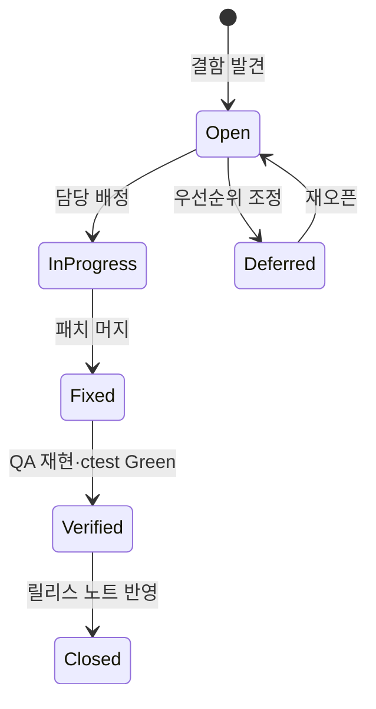
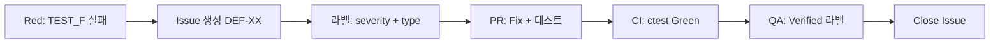

# TDD TV 프로젝트 — TVController 결함 관리 보고서

| 항목 | 내용 |
|---|---|
| 문서 번호 | RPT-08 |
| 단계 | 7단계 — 결함 관리 (Defect Management) |
| 프로젝트 | TDD TV (C++17, CMake, Google Test, Google Mock) |
| 기준 문서 | `docs/01_requirements_analysis.md`, `docs/03_test_plan.md`, `docs/05_02_defect_list.md` |
| 연관 보고서 | `Report/05_01_TVController_결함_분석_보고서.md` (RPT-06), `Report/05_02_TVController_결함_목록_보고서.md` (RPT-07) |
| 대상 모듈 | `TVController` (`include/TVController.h`, `src/TVController.cpp`) |
| 작성 관점 | QA 리드 엔지니어 (결함 분류·메트릭·추적 표준) |
| 작성일 | 2026-05-19 |

---

## 1. 보고서 개요

본 보고서는 TDD TV 프로젝트의 **결함 분류·보고·추적·품질 메트릭 수집**에 대한 QA 표준을 정의한다. 개별 결함의 상세 Steps·Root Cause·Fix Summary는 RPT-07을, 작업용 요약은 `docs/05_02_defect_list.md`를 참조한다.

| 목적 | 설명 |
|------|------|
| 분류 일관성 | Severity × ItemType 매트릭스로 등급·유형 판단 기준 통일 |
| 보고 표준화 | 재현·기대·실제·원인·수정·검증 필드를 갖춘 결함 보고서 템플릿 제공 |
| 품질 가시화 | 테스트 통과율·커버리지·단계별 결함 발견율 수집 계획 수립 |
| 이슈 연동 | (선택) GitHub Issues 워크플로우로 결함 생명주기 관리 |

---

## 2. 결함 분류 체계

### 2.1 Severity (심각도)

| 등급 | 정의 | 릴리스 영향 | 대응 SLA (권장) |
|------|------|-------------|-----------------|
| **Critical** | 핵심 채널 변경 경로 불가, P0 테스트 다수 실패, 데이터 손상 위험 | **릴리스 차단** | 즉시 (당일) |
| **Major** | 특정 시나리오(경계·검색·선호·숫자 버퍼) 오동작, P1 테스트 실패 | 릴리스 조건부 허용 불가 | 1 영업일 이내 |
| **Minor** | 빌드 경고·단일 경로 제한·비핵심 UI/로그 이슈 | 핫픽스 또는 다음 스프린트 | 3 영업일 이내 |
| **Info** | 문서·Mock 품질·커버리지 미측정 등 개선 권고, 기능 회귀 없음 | 릴리스 허용 | 백로그 |

**프로젝트 적용 예 (`docs/05_02_defect_list.md`):**

| Severity | 대표 ID | 설명 |
|----------|---------|------|
| Critical | DEF-01, DEF-02 | 2자리 즉시 확정·1자리+확인 확정 불가 |
| Major | DEF-03~07 | 보류 숫자 무효화·경계 래핑·검색/선호 탐색 |
| Minor | DEF-08 | `isDigitOrConfirm` 미선언 등 빌드 이슈 |
| Info | DEF-09 | Mock `NiceMock` 경고 등 테스트 품질 |

### 2.2 ItemType (결함 유형, 5종)

| 코드 | ItemType | 설명 | 판별 질문 |
|------|----------|------|-----------|
| **IT-F** | Functional | 요구사항·명세와 **관찰 가능한 동작** 불일치 | “사용자/테스트가 기대한 채널·상태가 나오는가?” |
| **IT-L** | Logic | 알고리즘·상태머신·경계·래핑 등 **내부 규칙** 오류 | “조건 분기·버퍼·순환 로직이 틀렸는가?” |
| **IT-I** | Interface | `Tuner`·`remoteKey`·Mock 계약·API 시그니처 불일치 | “모듈 간 호출·인자·반환값 계약이 깨졌는가?” |
| **IT-B** | Build | 컴파일·링크·CMake·환경·정적 분석 실패 | “빌드/CI 없이는 검증 자체가 불가한가?” |
| **IT-T** | TestQuality | 테스트·Mock·Fixture·커버리지·도구 설정 이슈 | “SUT는 정상이나 테스트 신뢰도·측정이 부족한가?” |

### 2.3 Severity × ItemType 매트릭스

셀 값: **대응 우선순위** (P0=즉시 차단, P1=스프린트 내, P2=백로그, P3=기록만)

| Severity \ ItemType | **IT-F** Functional | **IT-L** Logic | **IT-I** Interface | **IT-B** Build | **IT-T** TestQuality |
|---------------------|---------------------|----------------|--------------------|----------------|----------------------|
| **Critical** | P0 — 릴리스 차단, 핫픽스 | P0 — 핵심 경로 로직 수정 | P0 — 계약 파손 시 연쇄 실패 | P0 — CI Red, 빌드 복구 | P1 — 테스트 보강 후 재검증 |
| **Major** | P1 — 요구사항 매핑 테스트 추가 | P1 — 분기·경계 수정 | P1 — Mock/인터페이스 정합 | P1 — 빌드 옵션·의존성 | P2 — Fixture/Mock 개선 |
| **Minor** | P2 — 다음 스프린트 | P2 — 리팩터링 시 수정 | P2 — 문서·헤더 정리 | P2 — 경고 제거 | P2 — 경고·린트 |
| **Info** | P3 — 요구사항 갭 기록 | P3 — 설계 개선 제안 | P3 — API 문서화 | P3 — 도구 버전 기록 | P3 — 커버리지·Mock 정책 |

**매트릭스 활용 규칙**

1. 한 결함에 **주 ItemType 1개**를 지정하고, 필요 시 보조 ItemType을 메모한다.
2. **Critical + IT-L** 조합(예: DEF-01)은 P0 테스트 Green 전까지 머지 금지.
3. **Info + IT-T**(예: DEF-09)는 기능 Open 결함으로 승격하지 않는다.
4. IT-B가 Critical이면 IT-F/IT-L 분석 전에 빌드 복구를 선행한다.

### 2.4 프로젝트 결함 매핑 (참고)

| ID | Severity | ItemType | Function / 범위 |
|----|----------|----------|-----------------|
| DEF-01 | Critical | IT-L | `handleDigit` — 2자리 즉시 확정 |
| DEF-02 | Critical | IT-L / IT-F | `pushButton` — KEY_OK 확정 |
| DEF-03 | Major | IT-L | `pushButton` — 보류 숫자 무효화 |
| DEF-04 | Major | IT-L | `handleChannelUp` — 99→0 래핑 |
| DEF-05 | Major | IT-L | `handleChannelDown` — 0→99 래핑 |
| DEF-06 | Major | IT-L | `handleChannelSearch`, `handleChannelUp` |
| DEF-07 | Major | IT-L | `handleNextFavorite` |
| DEF-08 | Minor | IT-B | `isDigitOrConfirm` 미선언 |
| DEF-09 | Info | IT-T | `TVControllerTest` Mock 경고 |

---

## 3. 결함 보고서 템플릿

신규 결함 등록 시 아래 템플릿을 복사하여 `Report/` 또는 GitHub Issue에 기록한다.

```markdown
### DEF-XX — [한 줄 요약]

| 필드 | 내용 |
|------|------|
| **ID** | DEF-XX |
| **제목** | |
| **Severity** | Critical / Major / Minor / Info |
| **ItemType** | IT-F / IT-L / IT-I / IT-B / IT-T |
| **Status** | Open / In Progress / Fixed / Verified / Closed / Deferred |
| **FunctionName** | 예: `handleDigit`, `pushButton` |
| **요구사항 ID** | 예: D-02, U-03 (`docs/01_requirements_analysis.md` §5) |
| **TEST_F** | 예: `TwoDigits_ChangesImmediately` |
| **발견 단계** | Unit / Golden / Regression / CI / Code Review |
| **발견일** | YYYY-MM-DD |
| **담당** | Dev / QA |

#### 재현 (Steps to Reproduce)

1. Mock Tuner 현재 채널 `"0"` 설정
2. `pushButton(KEY_1)` 입력
3. `pushButton(KEY_2)` 입력
4. `expectChannel(12)` 검증 (`TVControllerTest.TwoDigits_ChangesImmediately`)

**환경:** OS, 컴파일러, CMake 빌드 타입, 커밋 SHA

#### 기대 결과 (Expected)

두 번째 숫자 입력 직후 채널 `"12"`로 즉시 확정. `Tuner::setCH("12")` 1회 호출.

#### 실제 결과 (Actual)

채널 `"0"` 유지. `setCH` 미호출 또는 잘못된 인자.

#### 원인 (Root Cause)

`processingCH`에 숫자만 누적하고 `size() >= 2`일 때 `confirmPendingDigits()` 미호출.

#### 수정 (Fix Summary)

`handleDigit` 종료 시 `if (processingCH.size() >= 2) confirmPendingDigits();` 추가.

**변경 파일:** `src/TVController.cpp` (줄 번호)

#### 검증 (Verification)

- [ ] 관련 `TEST_F` Green
- [ ] `ctest` 전체 통과 (목표: 23/23)
- [ ] 회귀 스모크 10건 (`docs/03_test_plan.md` §9) 통과
- [ ] (해당 시) lcov 라인 커버리지 ≥ 90% 유지
- [ ] 결함 상태 → **Verified** → **Closed**

**검증자 / 검증일:**
```

### 3.1 상태 전이



---

## 4. 품질 메트릭 수집 계획

### 4.1 메트릭 정의

| 메트릭 | 정의 | 목표 (TDD TV) | 수집 주기 |
|--------|------|---------------|-----------|
| **테스트 통과율** | `Passed / Total × 100` (ctest 기준) | **100%** (P0+P1 필수) | 매 커밋·PR |
| **라인 커버리지** | SUT 실행 라인 / 전체 라인 | **≥ 90%** (`src/TVController.cpp`) | PR·스프린트 종료 |
| **함수 커버리지** | 동일 | **≥ 95%** | PR·스프린트 종료 |
| **분기 커버리지** | (권장) | **≥ 85%** | 스프린트 종료 |
| **단계별 결함 발견율** | 해당 단계 신규 결함 수 / 해당 단계 투입 인일 | 추세 관리 (감소 목표) | 스프린트 종료 |
| **결함 밀도** | 결함 수 / KLOC (또는 함수 수) | 프로젝트 베이스라인 수립 | 릴리스 |
| **수정 검증률** | Verified+Closed / (Fixed+Verified+Closed) | **100%** | 주간 |
| **Critical 잔존** | Open/In Progress Critical 건수 | **0** (릴리스 게이트) | 매일 |

### 4.2 테스트 통과율 수집 (C++ / 본 프로젝트)

```bash
cmake -S . -B build -DCMAKE_BUILD_TYPE=Debug
cmake --build build
ctest --test-dir build --output-on-failure
```

**기록 형식 (스프린트 로그):**

```text
날짜: 2026-05-19
Total: 23 | Passed: 23 | Failed: 0 | Pass Rate: 100%
Targets: TunerTest(13), TVControllerTest(10)
```

| 타깃 | 현재 기준값 (2026-05-19) |
|------|-------------------------|
| `TunerTest` | 13/13 Passed |
| `TVControllerTest` | 10/10 Passed |
| **합계** | **23/23 (100%)** |

### 4.3 커버리지 수집 — 언어별 도구

| 언어 | 도구 | 본 프로젝트 적용 | 비고 |
|------|------|------------------|------|
| **C++** | **gcov + lcov** (+ genhtml) | **1차 표준** | `docs/03_test_plan.md` §6 |
| Java | JaCoCo | (다언어 확장 시) | Maven/Gradle 플러그인, HTML 리포트 |
| Python | pytest-cov | (다언어 확장 시) | `pytest --cov=pkg --cov-report=html` |

#### 4.3.1 C++ — gcov / lcov (TDD TV)

`CMakeLists.txt`에 `ENABLE_COVERAGE` 옵션 사용 (`docs/03_test_plan.md` §6.2).

```bash
cmake -S . -B build-cov -DENABLE_COVERAGE=ON
cmake --build build-cov
ctest --test-dir build-cov --output-on-failure

lcov --capture --directory build-cov --output-file coverage.info
lcov --remove coverage.info '/usr/*' '*/test/*' '*/googletest/*' '*/gmock/*' \
     --output-file coverage.filtered.info
lcov --summary coverage.filtered.info
genhtml coverage.filtered.info --output-directory build-cov/coverage-html
```

**PR 게이트 (권장):** 라인 커버리지 **≥ 88%** (CI), 로컬 **≥ 90%**.

**제외 대상:** `test/*`, `build/*`, googletest/gmock, `remoteKey.h`.

#### 4.3.2 Java — JaCoCo (참고)

```xml
<!-- pom.xml 예시 -->
<plugin>
  <groupId>org.jacoco</groupId>
  <artifactId>jacoco-maven-plugin</artifactId>
  <executions>
    <execution><goals><goal>prepare-agent</goal></goals></execution>
    <execution><id>report</id><phase>test</phase>
      <goals><goal>report</goal></goals></execution>
  </executions>
</plugin>
```

리포트: `target/site/jacoco/index.html` — 팀 목표치(예: 라인 80%)를 본 보고서 §4.1 메트릭 표와 동기화.

#### 4.3.3 Python — pytest-cov (참고)

```bash
pytest --cov=tvcontroller --cov-report=term-missing --cov-report=html
```

리포트: `htmlcov/index.html` — branch 옵션(`--cov-branch`)으로 분기 커버리지 병행.

### 4.4 단계별 결함 발견율

V-모델 단계와 TDD TV 실제 활동에 맞춘 수집 템플릿이다.

| 단계 | 활동 | 결함 발견 예 (본 프로젝트) | 기록 필드 |
|------|------|---------------------------|-----------|
| **요구사항 검토** | `docs/01_requirements_analysis.md` 리뷰 | 모호한 규칙, 누락 시나리오 | Review-ID, 건수 |
| **단위 테스트 (Red)** | `TVControllerTest` 실패 | DEF-01~07 | DEF-ID, Severity, ItemType |
| **단위 테스트 (Green)** | 수정 후 ctest | 잔존 0 목표 | Pass Rate |
| **골든/텍스트 테스트** | `TVControllerGoldenTest` | 회귀 문자열 불일치 | Golden-ID |
| **정적 분석/빌드** | 컴파일·린트 | DEF-08 | IT-B |
| **CI** | GitHub Actions `ctest` | 환경·플랫폼 이슈 | Workflow run URL |
| **회귀** | 스모크 10건 + 전체 ctest | 재발 결함 | Reopen 여부 |

**발견율 계산 예:**

```text
단위테스트_발견율 = (단위테스트_단계_신규_DEF) / (단위테스트_실행_테스트케이스_수) × 100
스프린트_결함_분포 = Critical:N, Major:N, Minor:N, Info:N  (단계별 스택)
```

**본 프로젝트 스냅샷 (2026-05-19):**

| 단계 | 신규 결함 | Fixed | Open |
|------|-----------|-------|------|
| 단위 테스트 (Red→Green) | DEF-01~08 | 8 | 0 |
| 테스트 품질 | DEF-09 | 0 | 1 (Info) |

### 4.5 메트릭 대시보드 (권장 산출물)

| 산출물 | 경로·형식 | 담당 |
|--------|-----------|------|
| ctest JUnit/XML | `build/Testing/` | CI |
| lcov HTML | `build-cov/coverage-html/index.html` | Dev/QA |
| 결함 요약 | `docs/05_02_defect_list.md` | QA |
| 스프린트 품질 로그 | `Report/` | QA 리드 |

### 4.6 수집 일정

| 시점 | 활동 |
|------|------|
| 매 커밋 (로컬) | P0 스모크 10건 또는 `TVControllerTest` |
| PR 생성 | `ctest` + (선택) lcov 하한 88% |
| 스프린트 종료 | 통과율·커버리지·결함 분포·발견 단계 표 갱신 |
| 릴리스 전 | Critical/Major Open = 0, 라인 커버리지 ≥ 90% |

---

## 5. (선택) GitHub Issues 연동 워크플로우

### 5.1 라벨 체계

| 라벨 | 용도 |
|------|------|
| `defect` | 결함 이슈 공통 |
| `severity:critical` / `major` / `minor` / `info` | Severity |
| `type:functional` / `logic` / `interface` / `build` / `test-quality` | ItemType |
| `status:verified` | QA 검증 완료 |
| `component:tv-controller` | 모듈 |

### 5.2 이슈 본문 매핑

GitHub Issue 생성 시 §3 템플릿의 **재현·기대·실제·원인·수정·검증** 섹션을 그대로 사용한다. Issue 번호와 내부 ID 매핑: `DEF-01` ↔ `#42`.

### 5.3 워크플로우 개요



### 5.4 PR 연동 (권장)

- PR 설명에 `Fixes #42` / `Closes DEF-01` 명시
- CI 필수 체크: `ctest` (참고: `docs/github-actions-ci.yml`)
- 머지 조건: 리뷰 승인 + CI Green + (정책 시) 커버리지 하한

### 5.5 Issue 템플릿 경로 (권장 파일)

`.github/ISSUE_TEMPLATE/defect_report.yml` — 본 보고서 §3 필드를 form 필드로 정의.

---

## 6. 요구사항·테스트 추적

결함 보고 시 다음 매핑을 반드시 기록한다.

| 출처 | 식별자 예 | 결함 보고서 필드 |
|------|-----------|------------------|
| 요구사항 분석 | §5 시나리오 1~21 | `요구사항 ID` |
| 테스트 계획 | D-01, U-03, F-03, S-01 | `TEST_F` / 계획 ID |
| 결함 목록 | DEF-01~09 | `ID` |

상세 Steps·Root Cause·Fix Summary는 `Report/05_02_TVController_결함_목록_보고서.md` (RPT-07)를 참조한다.

---

## 7. 릴리스 게이트 체크리스트

- [ ] `ctest` 통과율 **100%** (P0+P1 시나리오)
- [ ] Open **Critical / Major** = 0
- [ ] `src/TVController.cpp` 라인 커버리지 **≥ 90%** (또는 CI 하한 88%)
- [ ] `docs/05_02_defect_list.md` 상태 갱신
- [ ] 신규 결함은 §3 템플릿 또는 GitHub Issue로 등록

---

## 8. 참조 문서

| 문서 | 경로 |
|------|------|
| 요구사항 분석 | `docs/01_requirements_analysis.md` |
| 테스트 계획 | `docs/03_test_plan.md` |
| 결함 목록 (작업용) | `docs/05_02_defect_list.md` |
| 결함 분석 보고서 (RPT-06) | `Report/05_01_TVController_결함_분석_보고서.md` |
| 결함 목록 보고서 (RPT-07) | `Report/05_02_TVController_결함_목록_보고서.md` |
| 테스트 계획 보고서 | `Report/03_테스트_계획_보고서.md` |
| 프로젝트 README | `README.md` |

---

## 9. 결론

1. **Severity × ItemType** 매트릭스와 §3 템플릿으로 결함 등록·우선순위·검증 절차를 표준화한다.
2. **ctest 통과율·lcov 커버리지·단계별 발견율**을 스프린트마다 수집하여 RPT-06·RPT-07과 함께 품질 추세를 관리한다.
3. 현재 기능 결함(DEF-01~08)은 수정 완료, **DEF-09**(Info)만 Open이며 릴리스 게이트에 영향 없다.

---

*문서 끝 — RPT-08 TVController 결함 관리 보고서*
