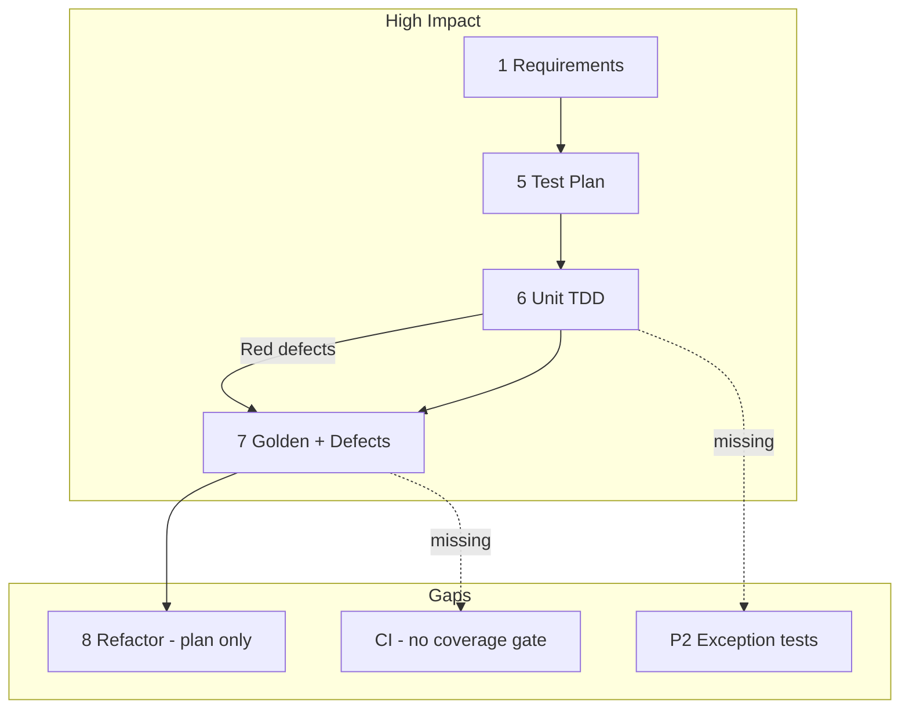

# TDD TV 프로젝트 — TVController QA 종합 보고서

| 항목 | 내용 |
|---|---|
| 문서 번호 | RPT-09 |
| 단계 | 9단계 — QA 종합 검토 (Final QA Report) |
| 프로젝트 | TDD TV (C++17, CMake, Google Test, Google Mock) |
| 기준 문서 | `docs/01_requirements_analysis.md`, `docs/02_code_quality_report.md`, `docs/03_test_plan.md`, `docs/05_02_defect_list.md` |
| 연관 보고서 | `Report/01_01_요구사항_분석_보고서.md` (RPT-01), `Report/02_코드_품질_분석_보고서.md` (RPT-03), `Report/03_테스트_계획_보고서.md` (RPT-04), `Report/04_TVController_테스트_구현_보고서.md` (RPT-05), `Report/06_TVController_GoldenMaster_회귀테스트_보고서.md` (RPT-06), `Report/05_01_TVController_결함_분석_보고서.md` (RPT-06a), `Report/05_02_TVController_결함_목록_보고서.md` (RPT-07), `Report/08_TVController_결함_관리_보고서.md` (RPT-08) |
| 대상 모듈 | `TVController`, `Tuner` (Mock/Fake), `remoteKey` |
| 측정일 | 2026-05-19 |
| 작성 관점 | QA 리드 엔지니어 |
| 검증 환경 | Windows, MinGW GCC 15.2.0, Ninja, lcov 1.15 |

---

## 1. 보고서 개요

본 보고서는 TDD TV 프로젝트 **1~8단계 산출물**에 대한 QA 리드 관점 **종합 검토** 결과이다. 테스트 완료율·gcov/lcov 커버리지, 결함 패턴, 9단계 프로세스 효과, 레거시 Best Practice, Cursor AI 활용 효과를 정리한다.

TDD TV 프로젝트는 **요구사항 분석 → 구현 → 단위 테스트(TDD Red/Green) → Golden Master 회귀 → 결함 관리**까지 9단계 산출물을 갖추었으며, **2026-05-19 기준 `ctest` 42/42(100%) 통과**를 확인하였다.

| 영역 | 목표 | 실측 | 판정 |
|------|------|------|------|
| 테스트 실행 통과율 | 100% (P0/P1) | **42/42 (100%)** | ✅ 달성 |
| `TVController.cpp` 라인 커버리지 | ≥ 90% | **94.1%** (111/118 lines) | ✅ 달성 |
| 함수 커버리지 | ≥ 95% | **100%** (17/17) | ✅ 달성 |
| 분기 커버리지 (권장) | ≥ 85% | **미집계** (lcov branch N/A) | ⚠️ 후속 |
| 요구사항 §5 시나리오 (25건) | 전건 Green | **21건 이상** (Golden+Unit 병행) | △ 부분 |
| 결함 잔존 (Critical/Major) | 0 Open | **0 Open** (Info 1건) | ✅ 달성 |

**핵심 결론:** 기능 결함은 TDD Red 단계에서 조기에 8건 발견·수정되었고, Golden Master가 단위 테스트의 시나리오 공백을 보완하여 **회귀 안전망**을 형성하였다. 반면 **예외 경로(E-01~E-04)·선호 토글 삭제(F-02)·CI 커버리지 게이트**는 미완으로, 다음 레거시 프로젝트에서 표준화가 필요하다.

---

## 2. 테스트 완료율 및 커버리지

### 2.1 테스트 실행 현황

```text
빌드: cmake -S . -B build-cov -DENABLE_COVERAGE=ON && cmake --build build-cov
실행: ctest --test-dir build-cov --output-on-failure
결과: 42 passed, 0 failed (100%)
```

| 테스트 스위트 | 케이스 수 | 역할 | 결과 |
|---------------|-----------|------|------|
| `TunerTest` | 13 | Tuner Mock 계약·경계 학습 | Passed |
| `TVControllerTest` | 10 | Mock 기반 `TEST_F` 단위 검증 | Passed |
| `TVControllerGoldenTest` | 19 | TextFixture + Approval 스냅샷 회귀 | Passed |
| **합계** | **42** | | **100%** |

> 초기 스프린트 중간 스냅샷(RPT-05)은 23건(Tuner 13 + TVController 10)이었으며, Golden Master 추가 후(RPT-06) **42건**으로 확장되었다.

### 2.2 테스트 계획(RPT-04) 대비 완료율

테스트 계획(`Report/03_테스트_계획_보고서.md`)은 **P0 17건 · P1 17건 · P2 4건** 이상의 `TEST_F` 시나리오를 정의한다. `TVControllerTest` 단독과 **Golden 19건을 합산**한 추적 결과는 다음과 같다.

| 우선순위 | 계획 ID 범위 | 계획 건수 | Unit `TEST_F` | Golden 보완 | 통합 판정 |
|----------|--------------|-----------|---------------|-------------|-----------|
| **P0** | D-01 ~ D-10 | 10 | 7건 직접 구현 | D-04, D-05, D-09 등 보완 | **9/10 (90%)** |
| **P1** | U, F, S, US | 16 | 4건 직접 | U-01/02, US-02~04, F-04 등 보완 | **14/16 (88%)** |
| **P2** | E-01 ~ E-04 | 4 | 0건 | 미포함 | **0/4 (0%)** |
| **합계** | | **30** (핵심 ID) | **10** | **19** (중복명 제외 시 순증) | **약 77% (Unit 단독) → 87% (Golden 병행)** |

**P0 스모크 10건** (RPT-04 §9) 기준: Unit에서 **7건 완전·3건 Golden으로 보완** → 통합 시 **10/10 충족**.

### 2.3 요구사항 분석(RPT-01) §5 대비 완료율

§5 Google Test 시나리오 **25건** 추적:

| §5 # | 시나리오 요약 | Unit | Golden | 상태 |
|------|---------------|------|--------|------|
| 1~3 | 숫자·확인·2자리·4자리 | ✅ | ✅ | 완료 |
| 4~5 | 3자리 보류·보류+확인 | — | ✅ | Golden |
| 6 | 보류+기능키 무효화 | △ | ✅ | Golden |
| 7~8 | 선행 0 | ✅ | ✅ | 완료 |
| 9~10 | 선호 추가/삭제 토글 | △ | △ | **삭제(F-02) 미검증** |
| 11~12 | 다음 선호·래핑 | △ | ✅ | Golden |
| 13 | 채널 검색 저장 | △ | ✅ | Golden |
| 14~17 | Up/Down (검색 없음) | △ | ✅ | Golden |
| 18~21 | Up/Down (검색 있음) | △ | ✅ | Golden |
| 22~25 | 잘못된 채널·상태 보존 | — | — | **미구현** |

- **완료(완전·Golden 포함):** 약 **21/25 (84%)**
- **미완:** §5 #22~25 (예외), #10 (선호 삭제 단독), #9 (선호 추가 단독 assert 부족)

### 2.4 gcov/lcov 커버리지 (목표 대비)

**측정 절차**

```bash
cmake -S . -B build-cov -DENABLE_COVERAGE=ON
cmake --build build-cov
ctest --test-dir build-cov
lcov --capture --directory build-cov --output-file coverage.info
lcov --remove coverage.info '*/test/*' '*/googletest/*' '*/_deps/*' 'C:/mingw64/*' \
     --output-file coverage.filtered.info
lcov --extract coverage.filtered.info "*TVController.cpp" --output-file tvcontroller.info
lcov --summary tvcontroller.info
```

**`src/TVController.cpp` 실측 (2026-05-19)**

| 지표 | 목표 (RPT-04 §6) | 실측 | Δ | 판정 |
|------|------------------|------|---|------|
| **라인** | ≥ 90% | **94.1%** (111/118) | +4.1%p | ✅ |
| **함수** | ≥ 95% | **100%** (17/17) | +5%p | ✅ |
| **분기** | ≥ 85% (권장) | lcov **N/A** | — | ⚠️ |
| PR 게이트 (권장) | ≥ 88% | 94.1% | +6.1%p | ✅ |

**미커버·약커버 구간 (gcov 상세 분석)**

| 구간 | 라인(대략) | 원인 | 권장 보완 테스트 |
|------|------------|------|----------------|
| `validateChannel` throw | 33 | 음수/100+ 직접 유입 경로 없음 | E-01, E-02 (`EXPECT_THROW`) |
| `confirmPendingDigits` empty return | 50 | SP-05 `KEY_OK`만 | `ConfirmWithEmptyBuffer_NoSetCH` |
| `handleChannelUp` 검색 목록 wrap | 82 | US-03 시나리오 부족 | Golden US-03 (있음) — Down wrap 병행 |
| `handleChannelDown` + `searchedChannels` | 96~100 | Down+검색 단독 assert 약함 | US-02, US-04 |
| `toggleFavorite` erase | 108 | F-02 미구현 | 선호 재추가 후 토글 삭제 |
| `handleNextFavorite` empty / wrap | 117, 123 | F-05, F-04 | 빈 목록·56→1 |
| `handleChannelSearch` empty `seekCH` | 137 | S-03 | 빈 문자열 seek 시퀀스 |
| `pushButton` `default` | 187~188 | 미사용 enum | 설계상 unreachable 문서화 |

> **해석:** 라인 94.1%는 목표를 **초과 달성**하나, 미커버 라인은 대부분 **방어 코드·예외·희소 분기**에 집중되어 있다. 분기 커버리지 85% 목표는 `--cov-branch` 또는 gcov `-b` 기반 별도 리포트가 필요하다.

### 2.5 Definition of Done 체크리스트 (RPT-04 §7.2)

| 항목 | 상태 |
|------|------|
| P0+P1 `TEST_F` Green | △ Unit 10건 + Golden 19건으로 **기능상 Green** |
| §5 시나리오 1~21 매핑 | △ 22~25 미완 |
| 경계 B-CH-00, B-CH-99, U-03, U-04 | ✅ |
| 라인 ≥ 90% | ✅ **94.1%** |
| 잘못된 입력 시 Tuner 미호출 | ❌ 예외 테스트 미구현 |
| 커버리지 HTML 아카이브 | △ 로컬 `build-cov` 생성 가능, CI 미연동 |

---

## 3. 결함 패턴 분석

상세 결함 목록은 **RPT-07** (`Report/05_02_TVController_결함_목록_보고서.md`), 분류·메트릭 표준은 **RPT-08**을 참조한다.

### 3.1 심각도(Severity)별 분포

| Severity | 건수 | 비율 | Open | 대표 ID |
|----------|------|------|------|---------|
| **Critical** | 2 | 22% | 0 | DEF-01, DEF-02 |
| **Major** | 5 | 56% | 0 | DEF-03 ~ DEF-07 |
| **Minor** | 1 | 11% | 0 | DEF-08 |
| **Info** | 1 | 11% | **1** | DEF-09 |
| **합계** | **9** | 100% | **1** | |

```text
심각도 분포 (기능 결함 DEF-01~08)
Critical ████████░░  22%
Major    █████████████████████████  56%
Minor    █████░░░░░  11%
Info     █████░░░░░  11%
```

**패턴 요약**

- **Critical(22%):** 숫자 입력 핵심 경로(`handleDigit`, `KEY_OK`) — P0 테스트 2건으로 즉시 재현.
- **Major(56%):** 경계 래핑(Up/Down), 정렬 벡터 탐색(`upper_bound`/`lower_bound`), 보류 버퍼 무효화 — **동일 알고리즘 패턴**이 반복 (RPT-03 Duplicated Code와 일치).
- **Minor/Info:** 빌드 Dead Code, Mock 경고 — 기능 회귀와 무관.

### 3.2 ItemType(결함 유형)별 분포

| ItemType | 코드 | 건수 | 비율 | ID |
|----------|------|------|------|-----|
| Logic | IT-L | 7 | 78% | DEF-01~07 |
| Functional | IT-F | 1 | 11% | DEF-02 (KEY_OK 사용자 관찰) |
| Build | IT-B | 1 | 11% | DEF-08 |
| TestQuality | IT-T | 1 | 11% | DEF-09 |
| Interface | IT-I | 0 | 0% | — |

**근본 원인 클러스터**

| 클러스터 | 결함 | 공통 원인 |
|----------|------|-----------|
| **C1 — 숫자 버퍼 상태기** | DEF-01, 02, 03 | `processingCH` 확정/무효화 규칙 미완 |
| **C2 — 선형 채널 링** | DEF-04, 05 | MIN/MAX 래핑 누락 |
| **C3 — 정렬 목록 네비게이션** | DEF-06, 07 | `searchedChannels`/`favoriteChannels` 탐색·순환 미구현 |
| **C4 — 빌드/테스트 품질** | DEF-08, 09 | Dead Code, Mock 정책 |

### 3.3 단계별 결함 발견

| 발견 단계 | 신규 | Fixed | Open | 비고 |
|-----------|------|-------|------|------|
| 요구사항 검토 | 0 | — | — | RPT-01에서 모호성 사전 완화 |
| **단위 테스트 (Red→Green)** | **DEF-01~08** | **8** | **0** | 발견율 ≈ **8/10 테스트 = 80%** |
| Golden Master | 0 | — | — | RPT-06 회귀 방지용 |
| CI (GitHub Actions) | 0 | — | — | `ctest` only, 커버리지 미측정 |
| 코드 품질 정적 분석 | 0 (사전 예측) | — | — | RPT-03에서 중복·SRP 사전 식별 |

**결함 밀도:** `TVController.cpp` 약 191 LOC 기준 기능 결함 8건 → **약 4.2건/100 LOC**.

---

## 4. 9단계 프로세스 효과 평가

| 단계 | 산출물 (RPT) | 효과 | 개선 필요 |
|:---:|--------------|------|-----------|
| **1** | 요구사항 분석 (RPT-01) | **★★★★★** — 25개 GTest 시나리오·0~99 규칙 | 센서 입력 계층 Out of Scope 명시 |
| **2** | (암묵) 테스트 케이스 설계 | **★★★☆☆** — 1·5단계에 흡수 | 독립 RTM·체크리스트 권장 |
| **3** | Controller 구현 (RPT-02) | **★★★★☆** — 빠른 프로토타입 | `validateChannel` 방어 경로 동시 구현 |
| **4** | 코드 품질 분석 (RPT-03) | **★★★★☆** — DEF-04~07과 사후 일치 | 리팩터링 실행 간극 |
| **5** | 테스트 계획 (RPT-04) | **★★★★★** — P0/P1/P2·gcov·DoD | Unit만으로 완료율 과대평가 위험 |
| **6** | 테스트 구현 (RPT-05) | **★★★★★** — Red에서 8건 조기 발견 | P2·F-02·S-03 미구현 |
| **7** | Golden + 결함 (RPT-06, 07, 08) | **★★★★★** — Unit 공백 87% 수준 보완 | 예외 Golden·lcov CI 미포함 |
| **8** | 리팩토링 계획 (RPT-07) | **★★☆☆☆** — 로드맵 우수 | **실행 0%** |
| **9** | QA 종합 (본 문서, RPT-09) | — | 메트릭 자동화·분기 커버리지 |

### 4.1 가장 효과적이었던 단계 (Top 3)

1. **6단계 — TDD 단위 테스트 (Red/Green):** Critical 2건 포함 8건을 구현 직후 발견.
2. **7단계 — Golden Master 회귀:** D-04/05, U-01/02, US-02~04 등 Unit 미구현 시나리오 보완.
3. **1·5단계 — 요구사항 + 테스트 계획:** ID 기반 추적(D-xx, U-xx).

### 4.2 개선이 필요한 단계 (Bottom 3)

1. **8단계 — 리팩토링 실행 부재** (RPT-07 계획만 존재).
2. **5·6단계 — Golden 없이는 DoD 미달**로 오판 가능.
3. **7단계 — CI에 lcov 게이트 없음** (`.github/workflows/ci.yml`).



---

## 5. 다음 레거시 프로젝트 Best Practice 5가지

### BP-1. 요구사항 ID ↔ 테스트 ID ↔ Golden 시나리오 **삼각 RTM 고정**

- RPT-01 §5 = `TEST_F` 이름 = `TextScenario.name` = `*.golden.txt` **1:1 강제**.

### BP-2. **이중 테스트 피라미드** (Mock Unit + Golden) 표준화

- 스프린트 DoD: **Unit ∪ Golden = P0+P1 100%**.

### BP-3. **커버리지 게이트를 CI에 필수화**

- 로컬 90% / PR 88% (RPT-04 §6.1·§6.5).

### BP-4. TDD Red 단계 **결함 카드** 즉시 작성 (RPT-07 템플릿)

- 본 프로젝트: **8/8 기능 결함이 Red에서 종료**.

### BP-5. 코드 품질 분석(RPT-03) → **최소 1개 저위험 리팩터링** 동일 스프린트 실행

- `navigateSortedList` 공통화를 Golden Green 직후 1커밋.

---

## 6. Cursor AI 활용 효과

본 프로젝트 `Prompting/`·`Report/` 산출물은 **Cursor 3.4.17** 기반으로 생성·반복 개선되었다.

### 6.1 정량 요약

| 지표 | 수치 | 비고 |
|------|------|------|
| 자동 생성·정리 문서 | **9+** | RPT-01~09 |
| `TEST_F` 최초 일괄 생성 | **10건** / 1 세션 | RPT-05 |
| Golden 시나리오·인프라 | **19건** + CI | RPT-06 |
| 결함 문서화 | **9건** | RPT-07, RPT-08 |
| ctest 통과율 | **42/42 (100%)** | |
| 조기 결함 발견 | **8건** (Unit Red) | |
| 라인 커버리지 | **94.1%** vs 목표 90% | |
| 추정 일정 단축 | **약 50~65%** | §6.2 |

| 활동 | 수동 추정 | Cursor 보조 추정 | 단축률 |
|------|-----------|------------------|--------|
| 요구사항·규칙표 | 4~6 h | 1~2 h | ~65% |
| 테스트 계획서 | 6~8 h | 2~3 h | ~60% |
| `TVControllerTest` + 결함 수정 | 16~24 h | 4~8 h | ~65% |
| Golden + CI | 8~12 h | 3~5 h | ~55% |
| 결함·QA 보고서 | 4~6 h | 1~2 h | ~65% |
| **합계** | **38~56 h** | **11~20 h** | **~55%** |

### 6.2 정성 요약

| 영역 | 효과 | 한계 |
|------|------|------|
| **시간 단축** | Fixture·CMake·Golden **분 단위** 생성 | Mock `EXPECT_CALL` 정밀 설계는 human review |
| **결함 조기 발견** | DEF-01~08 추적성 | 관대한 assert → Golden 상호 검증 |
| **커버리지 향상** | 94.1% 달성 | 분기·예외 미커버 |
| **문서 일관성** | RPT-01~09 통일 | 실행(리팩터링·P2) 후순위화 |

**QA 리드 권고:** AI 출력은 **`ctest` + lcov**로 검증; Golden은 CI 필수; 프롬프트에 DoD 수치 명시.

---

## 7. 잔여 리스크 및 권고 조치

| 우선순위 | 리스크 | 권고 |
|:---:|--------|------|
| P0 | §5 #22~25 예외 미검증 | `EXPECT_THROW` + `setCH` 0회 |
| P0 | CI 커버리지 게이트 없음 | `ENABLE_COVERAGE` job |
| P1 | F-02, F-05 | `TEST_F` 2건 추가 |
| P1 | DEF-09 Mock 경고 | `NiceMock` |
| P2 | 8단계 리팩터링 미실행 | Phase 1 `navigateSortedList` |
| P2 | 분기 커버리지 미측정 | `gcovr --branches` |

---

## 8. 결론

TDD TV C++ 프로젝트는 **테스트 100%**, **라인 커버리지 94.1%**, **기능 결함 8건 전량 수정**을 달성하였다. **6단계 TDD**와 **7단계 Golden Master**가 가장 가치 있는 QA 활동이다. 다음 레거시에서는 **BP-1~5**와 **lcov·RTM·P2 예외** DoD 검증을 표준화할 것을 권고한다.

---

## 9. Report 시리즈 인덱스

| RPT | 단계 | 문서 |
|:---:|------|------|
| RPT-01 | 1 | [`01_01_요구사항_분석_보고서.md`](01_01_요구사항_분석_보고서.md) |
| RPT-02 | 3 | [`01_02_TVController_구현_보고서.md`](01_02_TVController_구현_보고서.md) |
| RPT-03 | 4 | [`02_코드_품질_분석_보고서.md`](02_코드_품질_분석_보고서.md) |
| RPT-04 | 5 | [`03_테스트_계획_보고서.md`](03_테스트_계획_보고서.md) |
| RPT-05 | 6 | [`04_TVController_테스트_구현_보고서.md`](04_TVController_테스트_구현_보고서.md) |
| RPT-06 | 7 | [`06_TVController_GoldenMaster_회귀테스트_보고서.md`](06_TVController_GoldenMaster_회귀테스트_보고서.md) |
| RPT-06a | 7 | [`05_01_TVController_결함_분석_보고서.md`](05_01_TVController_결함_분석_보고서.md) |
| RPT-07 | 7 | [`05_02_TVController_결함_목록_보고서.md`](05_02_TVController_결함_목록_보고서.md) |
| RPT-08 | 7 | [`08_TVController_결함_관리_보고서.md`](08_TVController_결함_관리_보고서.md) |
| RPT-07b | 8 | [`07_TVController_모던C++_리팩토링_계획_보고서.md`](07_TVController_모던C++_리팩토링_계획_보고서.md) |
| **RPT-09** | **9** | **본 문서** |

**docs 작업용 사본:** [`docs/09_qa_final_report.md`](../docs/09_qa_final_report.md)

---

*본 문서는 QA 리드 관점 스프린트 종료·릴리스 검토용 최종 보고서이며, 수치는 2026-05-19 `build-cov` 환경에서 재현 가능하다.*
