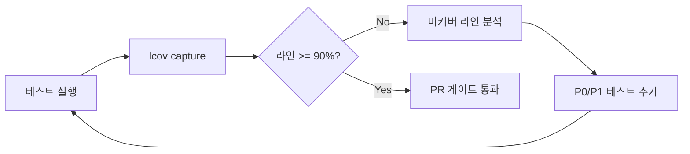

# TDD_TV 테스트 계획서

**문서 버전:** 1.0  
**작성 관점:** 시니어 QA 리드  
**대상:** `TVController` (C++17), Google Test, CMake  
**참조:** `README.md`, `docs/01_requirements_analysis.md`, `include/remoteKey.h`, `include/Tuner.h`, `include/TVController.h`, `src/TVController.cpp`

---

## 1. 목적 및 범위

### 1.1 목적

- 리모컨 입력 기반 채널 관리 모듈(`TVController`)의 **요구사항 충족 여부**를 `TEST_F` 중심 단위 테스트로 검증한다.
- 채널 번호 **0~99** 경계·순환·숫자 버퍼 규칙을 체계적으로 커버한다.
- **gcov/lcov**로 커버리지를 측정하고, **라인 커버리지 90% 이상**을 달성·유지한다.

### 1.2 테스트 대상 / 비대상

| 구분 | 대상 | 비고 |
|------|------|------|
| **SUT (System Under Test)** | `TVController::pushButton`, private 로직 간접 검증 | `Tuner`는 Mock/Fake |
| **계약 참조** | `Tuner::seekCH`, `setCH`, `getCurrentCH` | 호출 횟수·인자·반환값만 검증 |
| **비대상** | 실제 Tuner 하드웨어/업체 구현 | `TunerTest.cpp`는 Mock 사용법·계약 예시 |
| **비대상** | `remoteKey::to_string` | enum→문자열 유틸, Controller 동작과 무관 |
| **선택** | 센서 원천 데이터 파싱 계층 | 미구현 시 Controller 테스트와 분리 |

### 1.3 채널 도메인 상수

```text
MIN_CHANNEL = 0
MAX_CHANNEL = 99
유효 범위: 0 <= ch <= 99
```

---

## 2. 테스트 인프라

### 2.1 프레임워크 및 빌드

- **Google Test** + **Google Mock** (`FetchContent` googletest v1.14.0)
- 실행 파일: `TVControllerTest` (`test/TVControllerTest.cpp` + `src/TVController.cpp`)
- 기존 `TunerTest`는 Tuner **계약 학습용**이며, 본 계획의 커버리지 목표는 **`TVController` 소스**에 둔다.

### 2.2 공통 Fixture (`TEST_F`)

```cpp
class TVControllerTest : public ::testing::Test {
protected:
    MockTunerForController mockTuner;
    std::unique_ptr<TVController> controller;

    void SetUp() override {
        // 기본 현재 채널: "6" (요구사항 예시와 정합)
        ON_CALL(mockTuner, getCurrentCH())
            .WillByDefault(Return("6"));
        controller = std::make_unique<TVController>(&mockTuner);
    }

    void press(remoteKey key) { controller->pushButton(key); }
    void pressDigits(std::initializer_list<remoteKey> keys) {
        for (remoteKey k : keys) press(k);
    }
    // expectSetCH(12), expectSeekSequence(...), expectNoSetCH() 등 헬퍼 권장
};
```

- **Mock 기본 정책:** `getCurrentCH()`는 테스트별 `EXPECT_CALL`로 명시; `setCH`는 `EXPECT_CALL` + `WillOnce`/`Times`로 기대 채널 검증.
- **상태 검증:** public getter가 없으므로 **Tuner `setCH` 호출 인자**와 **추가 `seekCH` 시퀀스**로만 외부 관찰 가능한 동작을 검증한다. (선호/검색 목록 내부 상태는 동작 결과·연속 입력으로 간접 검증.)

### 2.3 테스트 명명 규칙

- `TEST_F(TVControllerTest, <기능>_<조건>_<기대결과>)`
- 요구사항 분석서 §5 시나리오 ID와 1:1 매핑 가능하도록 유지 (예: `DigitThenConfirm_ChangesToSingleDigitChannel`).

---

## 3. TEST_F 단위 테스트 범위 및 우선순위

### 3.1 우선순위 정의

| 우선순위 | 의미 | 릴리스 게이트 |
|----------|------|----------------|
| **P0** | 핵심 요구사항·회귀 방지 필수 | 100% 통과 필수 |
| **P1** | 주요 기능·경계값 | 100% 통과 필수 |
| **P2** | 예외·특이·조합 시나리오 | 95% 이상 통과, 미통과 시 이슈 등록 |
| **P3** | 리팩터링·품질 개선용 | 스프린트 내 점진 적용 |

### 3.2 P0 — 숫자 입력 및 확인 (요구사항 §1)

| ID | TEST_F 이름 (권장) | 입력 시퀀스 | 기대 동작 | Mock 검증 |
|----|-------------------|-------------|-----------|-----------|
| D-01 | `DigitThenConfirm_ChangesToSingleDigitChannel` | `KEY_1`, `KEY_OK` | 1번 채널 | `setCH("1")` 1회 |
| D-02 | `TwoDigits_ChangesImmediately` | `KEY_1`, `KEY_2` | 12번 즉시 확정 | `setCH("12")` |
| D-03 | `FourDigits_ChangesAsTwoPairs` | `1,2,3,4` | 12 → 34 | `setCH` 순서 `"12"`, `"34"` |
| D-04 | `ThirdDigit_StartsNextPendingInput` | `4,5,6` | 45 확정, 6 보류 | `setCH("45")` 후 추가 `setCH` 없음 |
| D-05 | `PendingSingleDigitConfirm_ChangesToPendingDigit` | `4,5,6`, `KEY_OK` | 최종 6번 | `setCH("45")`, `setCH("6")` |
| D-06 | `LeadingZeroThenDigit_ChangesToDigitChannel` | `0`, `7` | 7번 (선행 0 제거) | `setCH("7")` |
| D-07 | `LeadingZeroThenConfirm_ChangesToChannelZero` | `0`, `KEY_OK` | 0번 | `setCH("0")` |

### 3.3 P0 — 숫자 버퍼 무효화 (요구사항 §1)

| ID | TEST_F 이름 | 입력 | 기대 |
|----|-------------|------|------|
| D-08 | `PendingSingleDigitNonConfirmFunction_InvalidatesPendingDigit` | `4,5,6`, `KEY_CH_UP` | 6 무효화 후 Up만 수행 (현재 6→7) |
| D-09 | `PendingDigitChannelUp_ClearsBufferThenIncrements` | `4,5,6`, `KEY_CH_DOWN` | 버퍼 클리어 후 Down |
| D-10 | `PendingLeadingZeroThenFavorite_ClearsBuffer` | `0`, `KEY_FAVORITE_ADD` | 보류 `0` 무효화, 즐겨찾기만 |

### 3.4 P1 — 채널 Up/Down (검색 결과 없음, 요구사항 §5)

| ID | TEST_F 이름 | 초기 CH | 키 | 기대 CH |
|----|-------------|---------|-----|---------|
| U-01 | `ChannelUpWithoutSearchResult_IncrementsChannel` | 6 | UP | 7 |
| U-02 | `ChannelDownWithoutSearchResult_DecrementsChannel` | 6 | DOWN | 5 |
| U-03 | `ChannelUpWithoutSearchResult_WrapsFromMaxToMin` | 99 | UP | 0 |
| U-04 | `ChannelDownWithoutSearchResult_WrapsFromMinToMax` | 0 | DOWN | 99 |

### 3.5 P1 — 선호 채널 (요구사항 §2, §3)

| ID | TEST_F 이름 | 전제 | 동작 | 기대 |
|----|-------------|------|------|------|
| F-01 | `FavoriteButton_AddsCurrentChannelWhenNotFavorite` | CH 6, 목록 비어 있음 | FAVORITE_ADD | 다음 NEXT_FAVORITE에서 6 인식 |
| F-02 | `FavoriteButton_RemovesCurrentChannelWhenAlreadyFavorite` | CH 6 추가 후 | FAVORITE_ADD | 토글 제거 (NEXT 시 동작 없음/래핑) |
| F-03 | `NextFavorite_ChangesToNearestGreaterFavorite` | 목록 1,4,12,56 / CH 6 | NEXT_FAVORITE | `setCH("12")` |
| F-04 | `NextFavorite_WrapsToSmallestFavorite` | 목록 1,4,12,56 / CH 56 | NEXT_FAVORITE | `setCH("1")` |
| F-05 | `NextFavorite_EmptyList_NoSetCH` | 목록 비어 있음 | NEXT_FAVORITE | `setCH` 호출 없음 |

### 3.6 P1 — 채널 검색 (요구사항 §4)

| ID | TEST_F 이름 | Mock `seekCH` 시퀀스 | 기대 |
|----|-------------|----------------------|------|
| S-01 | `ChannelSearch_StoresSeekResults` | 7, 12, 20, 6(시작 복귀) | `seekCH` 반복 호출, 이후 Up/Down이 검색 목록 기준 |
| S-02 | `ChannelSearch_DeduplicatesAndSorts` | 14, 6, 6, 4, … | Up/Down 시 4,6,14 순서 탐색 |
| S-03 | `ChannelSearch_EmptySeekStopsEarly` | `""` 첫 반환 | 루프 종료, 빈 목록 → 일반 Up/Down |

### 3.7 P1 — 채널 Up/Down (검색 결과 있음, 요구사항 §6)

| ID | TEST_F 이름 | 저장 CH | 현재 | 키 | 기대 |
|----|-------------|---------|------|-----|------|
| US-01 | `ChannelUpWithSearchResult_ChangesToNextStoredChannel` | 4,6,14 | 6 | UP | 14 |
| US-02 | `ChannelDownWithSearchResult_ChangesToPreviousStoredChannel` | 4,6,14 | 6 | DOWN | 4 |
| US-03 | `ChannelUpWithSearchResult_WrapsToSmallestStoredChannel` | 4,6,14 | 15 | UP | 4 |
| US-04 | `ChannelDownWithSearchResult_ChangesToNearestLowerStoredChannel` | 4,6,14 | 15 | DOWN | 14 |

### 3.8 P2 — 예외·방어·Tuner 연동

| ID | TEST_F 이름 | 조건 | 기대 |
|----|-------------|------|------|
| E-01 | `InvalidChannelFromParse_ThrowsInvalidArgument` | (테스트 훅 필요, §4 참고) | `std::invalid_argument`, `setCH` 미호출 |
| E-02 | `InvalidChannelInput_PreservesPreviousState` | 예외 전후 | `getCurrentCH` 기반 동작·목록 불변 |
| E-03 | `ChannelSearch_InvalidSeekString_SkipsOrThrows` | `seekCH` → `"100"` | 정책 결정 후 테스트 (파싱 실패 vs 무시) |
| E-04 | `ConfirmWithEmptyBuffer_NoSetCH` | `KEY_OK`만 | `setCH` 없음 |

> **참고:** 현재 `TVController` public API는 `pushButton`만 제공한다. 요구사항 §4의 `ch < 0`, `ch > 99` 직접 설정 예외는 `validateChannel`/`parseChannel` 경로로만 도달 가능하며, 리모컨 숫자만으로는 100 이상 확정이 불가하다. **E-01/E-02**는 (a) 테스트 전용 `friend`/`#ifdef TEST` 래퍼, 또는 (b) `parseChannel` 단위 테스트용 테스트 더블 분리 중 하나를 개발팀과 합의 후 적용한다.

### 3.9 P3 — 파라미터화 보완 (`TEST_P`, 선택)

`TunerTest`의 `INSTANTIATE_TEST_SUITE_P` 패턴을 참고하여, 아래는 **경계 채널 스윕**용으로 `TEST_P` + `Values` 권장:

- 유효 채널: `0`, `1`, `9`, `10`, `98`, `99`
- Up/Down 1스텝: 각 CH에서 ±1 (래핑 제외)
- 두 자리 즉시 확정: `(d1,d2) → 10*d1+d2` 대표 조합

---

## 4. 경계값 케이스 목록 (채널 0 ~ 99)

### 4.1 단일 채널 경계 (P1, `TEST_P` 또는 개별 `TEST_F`)

| 케이스 ID | 채널 | 시나리오 | 입력/동작 | 기대 |
|-----------|------|----------|-----------|------|
| B-CH-00 | 0 | 최소 채널 확정 | `0` + `KEY_OK` | `setCH("0")` |
| B-CH-00d | 0 | 최소에서 Down | CH=0, `KEY_CH_DOWN` (검색 없음) | 99 (래핑) |
| B-CH-99 | 99 | 최대 채널 확정 | `9`,`9` (즉시) | `setCH("99")` |
| B-CH-99u | 99 | 최대에서 Up | CH=99, `KEY_CH_UP` (검색 없음) | 0 (래핑) |
| B-CH-01 | 1 | 최소+1 | `1` + `KEY_OK` | `setCH("1")` |
| B-CH-98 | 98 | 최대-1 | `9`,`8` | `setCH("98")` |

### 4.2 숫자 입력 조합 경계

| 케이스 ID | 입력 | 해석 | 기대 CH |
|-----------|------|------|---------|
| B-DIG-00 | `0`,`0` | "00" → 0 | 0 (2자리 즉시 확정) |
| B-DIG-09 | `0`,`9` | 선행 0 제거 | 9 |
| B-DIG-10 | `1`,`0` | 10 | 10 |
| B-DIG-99 | `9`,`9` | 99 | 99 |
| B-DIG-seq | `9`,`8`,`9` | 98 확정 → 9 보류 → `KEY_OK` | 9 |
| B-DIG-max | `9`,`9`,`9` | 99 확정 → 9 보류 | 마지막 OK 시 9 |

### 4.3 Up/Down 선형 탐색 경계 (검색 목록 없음)

| 현재 CH | UP 결과 | DOWN 결과 |
|---------|---------|-----------|
| 0 | 1 | 99 |
| 1 | 2 | 0 |
| 98 | 99 | 97 |
| 99 | 0 | 98 |

### 4.4 검색/선호 목록 탐색 경계

| 케이스 | 저장 목록 | 현재 | UP | DOWN |
|--------|-----------|------|-----|------|
| B-SR-01 | {0, 99} | 0 | 99 | 99 (래핑) |
| B-SR-02 | {0, 99} | 99 | 0 (래핑) | 0 |
| B-SR-03 | {6} | 6 | 6 (단일 원소 래핑) | 6 |
| B-FAV-01 | {1,4,12,56} | 0 | NEXT → 1 | — |
| B-FAV-02 | {1,4,12,56} | 99 | NEXT → 1 (래핑) | — |

### 4.5 유효하지 않은 채널 (요구사항 §3, §4)

| 값 | 유입 경로 | 기대 |
|----|-----------|------|
| -1, -12 | (직접 API 테스트 시) | `std::invalid_argument`, Tuner 미변경 |
| 100, 9999 | (직접 API 테스트 시) | 동일 |
| 리모컨만 | 2자리 버퍼 | **100 이상 확정 불가** — 별도 “불가” 테스트는 API 훅 또는 White-box |

---

## 5. 예외 및 특이 케이스 목록

### 5.1 예외 (`std::invalid_argument`)

| ID | 조건 | 검증 |
|----|------|------|
| EX-01 | `parseChannel` / `setChannel`에 `ch < 0` | `EXPECT_THROW`, `setCH` 0회 |
| EX-02 | `ch > 99` (예: 100) | 동일 |
| EX-03 | `std::stoi` 실패 문자열 (구현이 허용하는 경우) | `std::invalid_argument` 또는 `std::runtime_error` 정책 문서화 |

### 5.2 상태 보존 (예외 후)

| ID | 시나리오 | 검증 포인트 |
|----|----------|-------------|
| ST-01 | 잘못된 채널 설정 시도 후 | `getCurrentCH` 반환값 불변 |
| ST-02 | 예외 후 | `processingCH` 버퍼 불변 (White-box 또는 연속 입력 동작으로 추론) |
| ST-03 | 예외 후 | 선호/검색 목록 기반 Up/Down 동작 유지 |

### 5.3 특이·비기능 시나리오

| ID | 설명 | 기대 |
|----|------|------|
| SP-01 | 선호 목록 비어 있을 때 `KEY_NEXT_FAVORITE` | 채널 변경 없음 |
| SP-02 | 검색 중 `seekCH()` 빈 문자열 | 수집 중단, 이후 일반 Up/Down |
| SP-03 | 검색 중 시작 채널 재방문 (`wrapped`) | 루프 종료 |
| SP-04 | 숫자 보류 중 **모든** 비숫자·비확인 기능키 | `KEY_CH_UP/DOWN`, `KEY_CH_SEARCH`, `KEY_FAVORITE_ADD`, `KEY_NEXT_FAVORITE` 각각 버퍼 클리어 |
| SP-05 | `KEY_OK`만 연속 입력 | no-op (빈 버퍼) |
| SP-06 | 검색 후 목록 기준 Up, 이후 `KEY_CH_SEARCH` 재실행 | `searchedChannels` 갱신 |
| SP-07 | 동일 채널 즐겨찾기 토글 2회 | 목록 원상 복구 |
| SP-08 | 현재 CH가 검색 목록에 없을 때 Up (예: 15, 목록 4,6,14) | US-03/US-04와 동일 (nearest + wrap) |
| SP-09 | Tuner `getCurrentCH()`가 범위 밖 문자열 | Controller 동작 정의 필요 (방어 코드 또는 예외 전파) |

### 5.4 Mock 특이 케이스

| ID | Mock 설정 | 목적 |
|----|-----------|------|
| MK-01 | `seekCH`가 순환 목록 반환 | `handleChannelSearch` 루프·중복 제거 |
| MK-02 | `setCH` 호출 순서 StrictSequence | 다단계 숫자 입력 |
| MK-03 | `getCurrentCH`가 `setCH` 후 갱신되도록 `Invoke` | Up/Down 연쇄 테스트 |

---

## 6. 커버리지 목표 및 gcov/lcov 전략

### 6.1 목표 지표

| 지표 | 목표 | 측정 대상 |
|------|------|-----------|
| **라인 커버리지** | **≥ 90%** | `src/TVController.cpp` |
| **함수 커버리지** | **≥ 95%** | 동일 |
| **분기 커버리지** | **≥ 85%** (권장) | `pushButton`, `handleChannelUp/Down`, `handleChannelSearch` |
| PR 게이트 | 라인 **≥ 88%** | CI에서 하한선, 로컬 90% 권장 |

**제외 대상 (lcov remove):** `test/*`, `build/*`, googletest, Mock 헤더, `remoteKey.h` (로직 없음).

### 6.2 CMake 커버리지 빌드 (GCC/Clang)

`CMakeLists.txt`에 옵션 추가 예시:

```cmake
option(ENABLE_COVERAGE "Build with coverage" OFF)

if(ENABLE_COVERAGE)
    if(CMAKE_CXX_COMPILER_ID MATCHES "GNU|Clang")
        add_compile_options(--coverage -O0 -g)
        add_link_options(--coverage)
    endif()
endif()
```

빌드·실행:

```bash
cmake -S . -B build-cov -DENABLE_COVERAGE=ON
cmake --build build-cov
ctest --test-dir build-cov --output-on-failure
```

### 6.3 lcov 수집·리포트

```bash
# 0) gcovr 대안 가능; 본 문서는 lcov 기준
lcov --capture --directory build-cov --output-file coverage.info
lcov --remove coverage.info '/usr/*' '*/test/*' '*/googletest/*' '*/gmock/*' \
     --output-file coverage.filtered.info
lcov --list coverage.filtered.info
genhtml coverage.filtered.info --output-directory build-cov/coverage-html
```

Windows에서는 **MSYS2/MinGW gcc + lcov** 또는 **WSL** 환경 사용을 권장한다. MSVC는 `/PROFILE` + OpenCppCoverage 등 별도 도구가 필요하므로, 본 프로젝트 CI는 **GCC + lcov**를 1차 표준으로 한다.

### 6.4 커버리지 개선 전략 (90% 달성 로드맵)



| 단계 | 활동 | 담당 |
|------|------|------|
| 1 | P0 테스트 15건 구현 → **핵심 라인 70%+** | Dev |
| 2 | P1 경계·검색·선호 20건 → **85%+** | Dev |
| 3 | lcov `--list`로 미커버 분기 확인 (`default`, `wrapped`, `empty` 분기) | QA |
| 4 | P2 예외·특이 10건 + `TEST_P` 스윕 → **90%+** | Dev/QA |
| 5 | 회귀: `ctest` + 커버리지 하한 CI 스크립트 | DevOps |

**미커버가 예상되는 구간과 대응 테스트:**

| 코드 구간 | 커버용 테스트 |
|-----------|----------------|
| `confirmPendingDigits` 빈 버퍼 early return | SP-05 |
| `handleNextFavorite` empty | F-05 |
| `handleChannelSearch` `chStr.empty()` | S-03 |
| `handleChannelSearch` `wrapped` 종료 | S-01 (시작 CH 복귀 시퀀스) |
| `pushButton` `default` | (미사용 키 추가 시) 또는 enum 범위 밖 — 설계상 도달 불가 시 문서화 |
| `validateChannel` false 분기 | E-01 (테스트 훅) |
| `toggleFavorite` erase vs insert | F-01, F-02 |

### 6.5 CI 통합 (권장)

```bash
#!/bin/sh
set -e
cmake -S . -B build -DENABLE_COVERAGE=ON
cmake --build build
ctest --test-dir build --output-on-failure
lcov ... # §6.3
LINE_COV=$(lcov --summary coverage.filtered.info 2>&1 | grep lines | awk '{print $2}' | tr -d '%')
test "$(echo "$LINE_COV >= 90" | bc)" -eq 1
```

- 커버리지 아티팩트: `build-cov/coverage-html/index.html`
- PR 코멘트: 라인/함수/분기 요약 + 미커버 상위 5개 함수 링크

---

## 7. 테스트 실행 및 완료 기준

### 7.1 로컬 실행

```bash
cmake -S . -B build
cmake --build build
ctest --test-dir build -R TVControllerTest --output-on-failure
```

### 7.2 완료 기준 (Definition of Done)

- [ ] `TVControllerTest` **P0 + P1** 시나리오 전부 `TEST_F` 구현 및 Green
- [ ] `docs/01_requirements_analysis.md` §5 시나리오 1~21번과 **이름·동작 매핑** 표 작성 (테스트 리뷰 체크리스트)
- [ ] 경계값 §4 표의 **B-CH-00, B-CH-99, B-DIG-99, U-03, U-04** 통과
- [ ] `src/TVController.cpp` lcov **라인 ≥ 90%**
- [ ] Mock 검증: 잘못된 입력 시 **`setCH` / `seekCH` 미호출** (해당 시나리오)
- [ ] 커버리지 HTML 아카이브 (스프린트 산출물)

### 7.3 요구사항 추적 매트릭스 (요약)

| README / 분석서 항목 | 테스트 ID |
|---------------------|-----------|
| 숫자 + 확인 | D-01, D-07 |
| 두 자리 즉시 | D-02, D-03 |
| 세 번째 숫자 보류 | D-04, D-05 |
| 기능키 시 버퍼 삭제 | D-08~D-10 |
| 선행 0 | D-06, B-DIG-09 |
| 선호 토글 | F-01, F-02 |
| 다음 선호 | F-03, F-04 |
| 채널 검색 | S-01~S-03 |
| Up/Down (일반) | U-01~U-04 |
| Up/Down (검색) | US-01~US-04 |
| 잘못된 채널 | E-01~E-02, §4.5 |

---

## 8. 리스크 및 가정

| 리스크 | 영향 | 완화 |
|--------|------|------|
| 내부 상태 비공개 | 선호/검색 목록 직접 assert 불가 | 연속 `pushButton`으로 간접 검증 |
| `Tuner` 문자열 API | `stoi` 예외 | Mock은 항상 `"0"`~`"99"` 반환 |
| public `setChannel` 부재 | EX-01 직접 테스트 곤란 | 테스트 훅 또는 리팩터링 합의 |
| Windows 네이티브 MSVC | gcov/lcov 미지원 | WSL/MinGW 또는 CI Linux job |
| `isDigitOrConfirm` 미선언 멤버 | 빌드 실패 가능 | 구현 정리 후 테스트 착수 |

**가정:** Tuner는 스펙대로 정확히 동작하며, Controller 테스트에서는 **Mock이 계약을 대변**한다. 채널 검색 루프 상한은 구현(`MAX_CHANNEL` 기반)을 따르되, Mock 시퀀스 길이로 종료 조건을 명시한다.

---

## 9. 부록: P0 최소 실행 세트 (스모크 10건)

1. D-01 `DigitThenConfirm_ChangesToSingleDigitChannel`  
2. D-02 `TwoDigits_ChangesImmediately`  
3. D-06 `LeadingZeroThenDigit_ChangesToDigitChannel`  
4. D-08 `PendingSingleDigitNonConfirmFunction_InvalidatesPendingDigit`  
5. U-01 `ChannelUpWithoutSearchResult_IncrementsChannel`  
6. U-03 `ChannelUpWithoutSearchResult_WrapsFromMaxToMin`  
7. F-03 `NextFavorite_ChangesToNearestGreaterFavorite`  
8. S-01 `ChannelSearch_StoresSeekResults` (간략 시퀀스)  
9. US-01 `ChannelUpWithSearchResult_ChangesToNextStoredChannel`  
10. F-01 `FavoriteButton_AddsCurrentChannelWhenNotFavorite`

위 10건 Green 시 **핵심 요구사항 회귀 스모크**로 매 커밋 실행을 권장한다.
